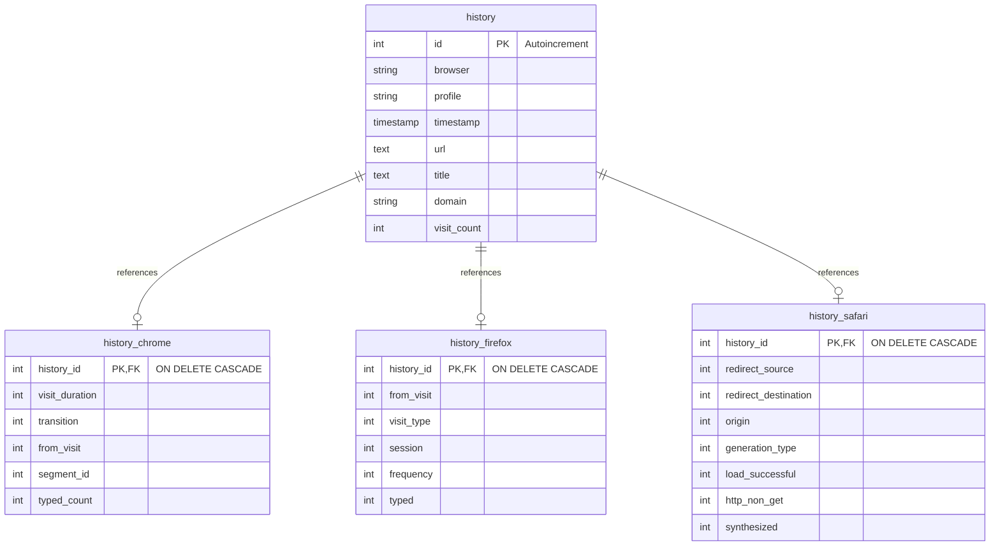

# Extended Database Schemas

## Relational Schema (`--flat=false`, `-M both` / default)

```mermaid
erDiagram
    history {
        int id PK "Autoincrement"
        string browser
        string profile
        timestamp timestamp
        text url
        text title
        string domain
        int visit_count
    }
    history_chrome {
        int history_id PK, FK "ON DELETE CASCADE"
        int visit_duration
        int transition
        int from_visit
        int segment_id
        int typed_count
    }
    history_firefox {
        int history_id PK, FK "ON DELETE CASCADE"
        int from_visit
        int visit_type
        int session
        int frequency
        int typed
    }
    history_safari {
        int history_id PK, FK "ON DELETE CASCADE"
        int redirect_source
        int redirect_destination
        int origin
        int generation_type
        int load_successful
        int http_non_get
        int synthesized
    }
    history ||--o| history_chrome : references
    history ||--o| history_firefox : references
    history ||--o| history_safari : references
```
