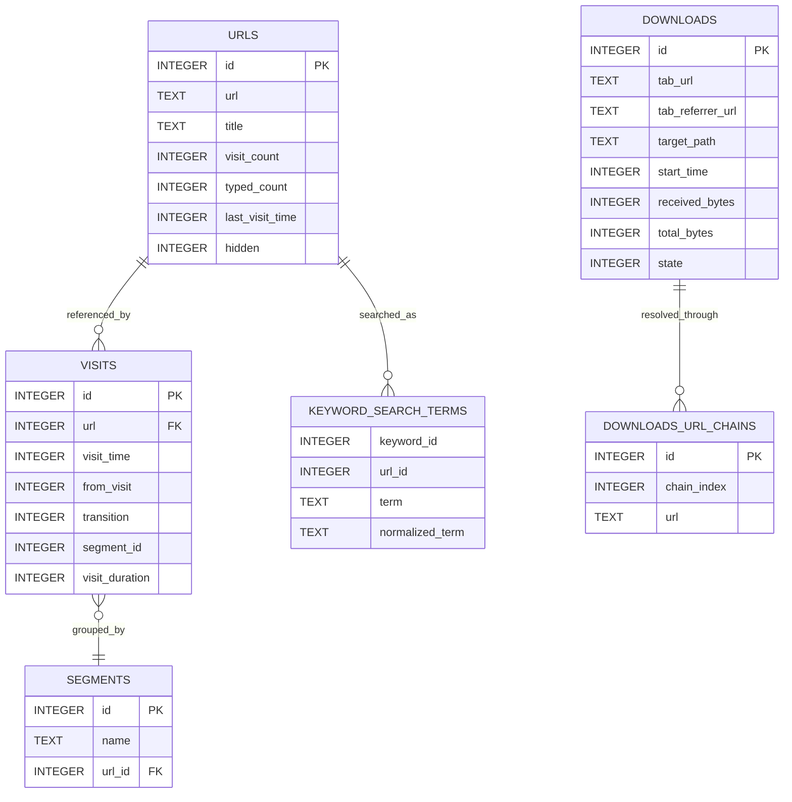
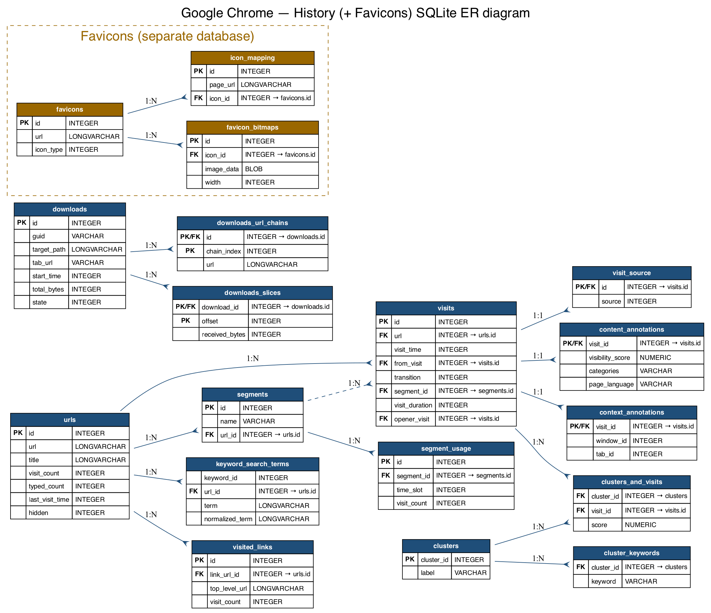
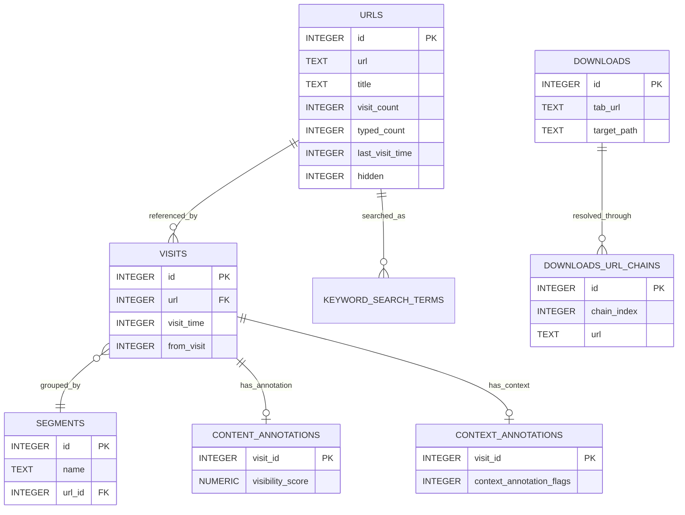

# Google Chrome Internal Browser Data Stores

## Scope

This document describes the principal on‑disk data stores used by Google Chrome and Chromium‑based browsers to persist browsing history, bookmarks, downloads, favicons, and session‑related state. The emphasis is on practical structural understanding: file purpose, storage format, major schema elements, relationships between records, and representative SQLite queries that can be adapted for inspection and forensic analysis.

All schema, column lists, and example queries below were verified against a real Chrome profile (`tmp/chrome/`) using SQLite 3.

## Profile artifacts

Chrome stores user data inside a profile directory, and different artifact families use different serialization formats rather than a single unified database.

| Artifact | Typical format | Primary purpose |
|---|---|---|
| `History` | SQLite | Browsing history, visits, downloads, search terms, segments, and related metadata. |
| `Favicons` | SQLite (separate DB) | Favicon images and the page‑URL → icon mappings. |
| `Top Sites` | SQLite (separate DB) | Most‑visited thumbnails for the new‑tab page. |
| `Bookmarks` | JSON | Bookmark tree, folders, bookmark metadata, synced roots. |
| `Sessions/` | Internal session serialization | Open windows, tabs, tab navigation state, and session‑restore information (`Session_*` / `Tabs_*` files). |
| `Session Storage/` | LevelDB | The DOM `sessionStorage` web‑storage API (per‑origin) — **not** session restore. |

> Verified against the supplied profile: there is **no** `favicons` table inside `History`, and the `urls` table has **no** `favicon_id` column. Favicons live in the separate `Favicons` database.

## Core history schema

The central design distinction in Chrome history storage is that a URL is stored once in `urls`, while each navigation event is stored separately in `visits`.



### `urls`

The `urls` table contains one row per distinct URL known to the history subsystem, with metadata such as title, visit counters, typed counters, and the last visit timestamp. In current Chrome the columns are exactly: `id, url, title, visit_count, typed_count, last_visit_time, hidden`. (Older Chrome releases also had a `favicon_id` column; it has been removed and favicons are now mapped in the separate `Favicons` database.)

### `visits`

The `visits` table records individual visit events and links each event to `urls.id` through the `url` foreign key.

### `segments` and `segment_usage`

A *segment* groups visits to a representative URL (used to rank most‑visited pages). `segments.url_id` references `urls.id`, and `segment_usage` accumulates per‑time‑slot visit counts.

### `downloads` and `downloads_url_chains`

Download activity is stored in `downloads`, while URL redirection chains associated with a download are preserved in `downloads_url_chains` (one row per hop, keyed by `(id, chain_index)`).

## Full `History` SQLite schema

The following reflects the actual `History` database (column lists match the live profile; `urls` has no `favicon_id`).

```sql
CREATE TABLE meta(key LONGVARCHAR NOT NULL UNIQUE PRIMARY KEY, value LONGVARCHAR);

CREATE TABLE urls(
    id INTEGER PRIMARY KEY AUTOINCREMENT,
    url LONGVARCHAR,
    title LONGVARCHAR,
    visit_count INTEGER DEFAULT 0 NOT NULL,
    typed_count INTEGER DEFAULT 0 NOT NULL,
    last_visit_time INTEGER NOT NULL,
    hidden INTEGER DEFAULT 0 NOT NULL
);

CREATE TABLE visits(
    id INTEGER PRIMARY KEY AUTOINCREMENT,
    url INTEGER NOT NULL,
    visit_time INTEGER NOT NULL,
    from_visit INTEGER,
    external_referrer_url TEXT,
    transition INTEGER DEFAULT 0 NOT NULL,
    segment_id INTEGER,
    visit_duration INTEGER DEFAULT 0 NOT NULL,
    incremented_omnibox_typed_score BOOLEAN DEFAULT FALSE NOT NULL,
    opener_visit INTEGER,
    originator_cache_guid TEXT,
    originator_visit_id INTEGER,
    originator_from_visit INTEGER,
    originator_opener_visit INTEGER,
    is_known_to_sync BOOLEAN DEFAULT FALSE NOT NULL,
    consider_for_ntp_most_visited BOOLEAN DEFAULT FALSE NOT NULL,
    visited_link_id INTEGER DEFAULT 0 NOT NULL,
    app_id TEXT
);
CREATE INDEX visits_url_index ON visits (url);
CREATE INDEX visits_from_index ON visits (from_visit);
CREATE INDEX visits_time_index ON visits (visit_time);
CREATE INDEX visits_originator_id_index ON visits (originator_visit_id);

CREATE TABLE visit_source(id INTEGER PRIMARY KEY, source INTEGER NOT NULL);

CREATE TABLE keyword_search_terms(
    keyword_id INTEGER NOT NULL,
    url_id INTEGER NOT NULL,
    term LONGVARCHAR NOT NULL,
    normalized_term LONGVARCHAR NOT NULL
);
CREATE INDEX keyword_search_terms_index1 ON keyword_search_terms (keyword_id, normalized_term);
CREATE INDEX keyword_search_terms_index2 ON keyword_search_terms (url_id);
CREATE INDEX keyword_search_terms_index3 ON keyword_search_terms (term);

CREATE TABLE downloads (
    id INTEGER PRIMARY KEY,
    guid VARCHAR NOT NULL,
    current_path LONGVARCHAR NOT NULL,
    target_path LONGVARCHAR NOT NULL,
    start_time INTEGER NOT NULL,
    received_bytes INTEGER NOT NULL,
    total_bytes INTEGER NOT NULL,
    state INTEGER NOT NULL,
    danger_type INTEGER NOT NULL,
    interrupt_reason INTEGER NOT NULL,
    hash BLOB NOT NULL,
    end_time INTEGER NOT NULL,
    opened INTEGER NOT NULL,
    last_access_time INTEGER NOT NULL,
    transient INTEGER NOT NULL,
    referrer VARCHAR NOT NULL,
    site_url VARCHAR NOT NULL,
    embedder_download_data VARCHAR NOT NULL,
    tab_url VARCHAR NOT NULL,
    tab_referrer_url VARCHAR NOT NULL,
    http_method VARCHAR NOT NULL,
    by_ext_id VARCHAR NOT NULL,
    by_ext_name VARCHAR NOT NULL,
    by_web_app_id VARCHAR NOT NULL,
    etag VARCHAR NOT NULL,
    last_modified VARCHAR NOT NULL,
    mime_type VARCHAR(255) NOT NULL,
    original_mime_type VARCHAR(255) NOT NULL
);

CREATE TABLE downloads_url_chains (
    id INTEGER NOT NULL,
    chain_index INTEGER NOT NULL,
    url LONGVARCHAR NOT NULL,
    PRIMARY KEY (id, chain_index)
);

CREATE TABLE downloads_slices (
    download_id INTEGER NOT NULL,
    offset INTEGER NOT NULL,
    received_bytes INTEGER NOT NULL,
    finished INTEGER NOT NULL DEFAULT 0,
    PRIMARY KEY (download_id, offset)
);

CREATE TABLE segments (id INTEGER PRIMARY KEY, name VARCHAR, url_id INTEGER NOT NULL);
CREATE INDEX segments_name ON segments(name);
CREATE INDEX segments_url_id ON segments(url_id);

CREATE TABLE segment_usage (
    id INTEGER PRIMARY KEY,
    segment_id INTEGER NOT NULL,
    time_slot INTEGER NOT NULL,
    visit_count INTEGER DEFAULT 0 NOT NULL
);
CREATE INDEX segment_usage_time_slot_segment_id ON segment_usage(time_slot, segment_id);
CREATE INDEX segments_usage_seg_id ON segment_usage(segment_id);

CREATE TABLE content_annotations(
    visit_id INTEGER PRIMARY KEY,
    visibility_score NUMERIC,
    floc_protected_score NUMERIC,
    categories VARCHAR,
    page_topics_model_version INTEGER,
    annotation_flags INTEGER NOT NULL,
    entities VARCHAR,
    related_searches VARCHAR,
    search_normalized_url VARCHAR,
    search_terms LONGVARCHAR,
    alternative_title VARCHAR,
    page_language VARCHAR,
    password_state INTEGER DEFAULT 0 NOT NULL,
    has_url_keyed_image BOOLEAN NOT NULL
);

CREATE TABLE context_annotations(
    visit_id INTEGER PRIMARY KEY,
    context_annotation_flags INTEGER NOT NULL,
    duration_since_last_visit INTEGER,
    page_end_reason INTEGER,
    total_foreground_duration INTEGER,
    browser_type INTEGER DEFAULT 0 NOT NULL,
    window_id INTEGER DEFAULT -1 NOT NULL,
    tab_id INTEGER DEFAULT -1 NOT NULL,
    task_id INTEGER DEFAULT -1 NOT NULL,
    root_task_id INTEGER DEFAULT -1 NOT NULL,
    parent_task_id INTEGER DEFAULT -1 NOT NULL,
    response_code INTEGER DEFAULT 0 NOT NULL
);

CREATE TABLE clusters(
    cluster_id INTEGER PRIMARY KEY AUTOINCREMENT,
    should_show_on_prominent_ui_surfaces BOOLEAN NOT NULL,
    label VARCHAR NOT NULL,
    raw_label VARCHAR NOT NULL,
    triggerability_calculated BOOLEAN NOT NULL,
    originator_cache_guid TEXT NOT NULL,
    originator_cluster_id INTEGER NOT NULL
);

CREATE TABLE clusters_and_visits(
    cluster_id INTEGER NOT NULL,
    visit_id INTEGER NOT NULL,
    score NUMERIC DEFAULT 0 NOT NULL,
    engagement_score NUMERIC DEFAULT 0 NOT NULL,
    url_for_deduping LONGVARCHAR NOT NULL,
    normalized_url LONGVARCHAR NOT NULL,
    url_for_display LONGVARCHAR NOT NULL,
    interaction_state INTEGER DEFAULT 0 NOT NULL,
    PRIMARY KEY(cluster_id, visit_id)
) WITHOUT ROWID;
CREATE INDEX clusters_for_visit ON clusters_and_visits(visit_id);

CREATE TABLE cluster_keywords(
    cluster_id INTEGER NOT NULL,
    keyword VARCHAR NOT NULL,
    type INTEGER NOT NULL,
    score NUMERIC NOT NULL,
    collections VARCHAR NOT NULL
);
CREATE INDEX cluster_keywords_cluster_id_index ON cluster_keywords(cluster_id);

CREATE TABLE cluster_visit_duplicates(
    visit_id INTEGER NOT NULL,
    duplicate_visit_id INTEGER NOT NULL,
    PRIMARY KEY(visit_id, duplicate_visit_id)
) WITHOUT ROWID;

CREATE TABLE visited_links (
    id INTEGER PRIMARY KEY AUTOINCREMENT,
    link_url_id INTEGER NOT NULL,
    top_level_url LONGVARCHAR NOT NULL,
    frame_url LONGVARCHAR NOT NULL,
    visit_count INTEGER DEFAULT 0 NOT NULL
);
CREATE INDEX visited_links_index ON visited_links (link_url_id, top_level_url, frame_url);

CREATE TABLE history_sync_metadata (storage_key INTEGER PRIMARY KEY NOT NULL, value BLOB);

CREATE INDEX urls_url_index ON urls (url);
```



*ER diagram generated with Graphviz directly from the verified live schema (column names and types match the database exactly).*

### Object inventory of `History`

Verified with `.schema` against the live profile: **19 tables, 18 indexes, 0 triggers, 0 views**. Chrome's `History` database defines no views or triggers — the index list embedded in the full schema above is complete. (A full scan of *all* ~24 SQLite databases in the Chrome profile likewise found **no views** anywhere, and **no triggers**.)

## Favicons (separate `Favicons` database)

Favicons are stored in their own SQLite database (`Favicons`), not in `History`. A page URL maps to one or more icons through `icon_mapping`, and each icon has one or more bitmaps (different sizes) in `favicon_bitmaps`.

```sql
-- These tables live in the Favicons database, NOT in History.
CREATE TABLE favicons(
    id INTEGER PRIMARY KEY,
    url LONGVARCHAR NOT NULL,        -- the favicon's own URL
    icon_type INTEGER DEFAULT 1
);
CREATE TABLE favicon_bitmaps(
    id INTEGER PRIMARY KEY,
    icon_id INTEGER NOT NULL,        -- references favicons.id
    last_updated INTEGER DEFAULT 0,
    image_data BLOB,
    width INTEGER DEFAULT 0,
    height INTEGER DEFAULT 0,
    last_requested INTEGER DEFAULT 0
);
CREATE TABLE icon_mapping(
    id INTEGER PRIMARY KEY,
    page_url LONGVARCHAR NOT NULL,   -- the page URL (matches urls.url by string)
    icon_id INTEGER,                 -- references favicons.id
    page_url_type INTEGER DEFAULT 0
);
```

## ER diagram including auxiliary tables



> Note: the content/context annotation tables are keyed by `visit_id` (1:1 with `visits.id`), not by `urls.id`. Favicons are intentionally omitted here because they reside in the separate `Favicons` database (see above), where the page link is by URL string, not by a numeric `urls.id` foreign key.

## Non‑SQLite artifacts

* **Bookmarks** – stored in the `Bookmarks` JSON file. The structure is `{ "checksum", "roots": { "bookmark_bar", "other", "synced" }, "version" }`; each node has `type` (`url`/`folder`), `name`, `url` (for URL nodes), `date_added`, `guid`, and `children` (for folders). Parse with any JSON library.
* **Session restoration** – Chrome writes session state to a proprietary binary format handled by the *session service*. The files live in the **`Sessions/`** directory (`Session_*` and `Tabs_*` files) and can be interpreted with tooling from the Chromium source. (Do not confuse this with `Session Storage/`, which is a LevelDB store for the DOM `sessionStorage` web API.)

## Example queries

All queries below were executed successfully against the supplied profile.

```sql
-- 10 most recently visited URLs (last_visit_time is microseconds since 1601‑01‑01 UTC)
SELECT url, title,
       datetime(last_visit_time/1000000 - 11644473600, 'unixepoch') AS last_visit
FROM urls
ORDER BY last_visit_time DESC
LIMIT 10;

-- Join visits to their URL
SELECT u.url, datetime(v.visit_time/1000000 - 11644473600, 'unixepoch') AS visited
FROM visits v
JOIN urls u ON u.id = v.url
ORDER BY v.visit_time DESC
LIMIT 20;

-- Most frequent search terms
SELECT term, COUNT(*) AS cnt
FROM keyword_search_terms
GROUP BY term
ORDER BY cnt DESC
LIMIT 20;

-- Downloads with their redirect chains
SELECT d.id, d.target_path, dc.chain_index, dc.url
FROM downloads d
LEFT JOIN downloads_url_chains dc ON dc.id = d.id
ORDER BY d.start_time DESC, dc.chain_index ASC
LIMIT 20;

-- Favicons: run against the separate Favicons database.
-- Page URL → icon → bitmap (with sizes).
SELECT im.page_url, fb.width, fb.height, fb.image_data
FROM icon_mapping im
JOIN favicon_bitmaps fb ON fb.icon_id = im.icon_id
LIMIT 10;
```

## Enriched real‑world queries (verified against a live profile)

These are the "everyday" analyst queries: they decode the cryptic columns (transition, state, epochs), self‑join to resolve referrers/redirects, and `ATTACH` the sibling databases to pull in search engines and favicons. Every query below was executed successfully against the supplied profile.

```sql
-- 1) Full enriched history timeline: human time, decoded navigation type,
--    dwell seconds, and the resolved referring URL (visits self-join).
SELECT datetime(v.visit_time/1000000-11644473600,'unixepoch','localtime') AS visited,
       u.title,
       u.url,
       CASE v.transition & 0xff
            WHEN 0 THEN 'LINK'    WHEN 1 THEN 'TYPED'   WHEN 2 THEN 'BOOKMARK'
            WHEN 3 THEN 'SUBFRAME' WHEN 5 THEN 'RELOAD' WHEN 7 THEN 'KEYWORD'
            ELSE 'OTHER('||(v.transition & 0xff)||')' END AS nav_type,
       round(v.visit_duration/1000000.0,1) AS dwell_s,
       ref.url AS referrer
FROM visits v
JOIN urls  u   ON u.id = v.url
LEFT JOIN visits pv ON pv.id = v.from_visit      -- referring visit
LEFT JOIN urls   ref ON ref.id = pv.url           -- referring URL
ORDER BY v.visit_time DESC;

-- 2) Search history enriched with the search-engine name.
--    keyword_search_terms lives in History; engine names in 'Web Data'.
ATTACH 'Web Data' AS wd;
SELECT k.short_name AS engine,
       kst.term,
       u.url,
       datetime(u.last_visit_time/1000000-11644473600,'unixepoch') AS last_searched
FROM keyword_search_terms kst
JOIN urls u ON u.id = kst.url_id
LEFT JOIN wd.keywords k ON k.id = kst.keyword_id
ORDER BY u.last_visit_time DESC;

-- 3) Downloads fully enriched: size in MB, decoded state, MIME, originating tab,
--    redirect-hop count, and the full ordered redirect chain.
SELECT d.id,
       d.target_path,
       round(d.total_bytes/1048576.0,2) AS MB,
       CASE d.state WHEN 0 THEN 'in_progress' WHEN 1 THEN 'complete'
            WHEN 2 THEN 'cancelled' WHEN 3 THEN 'interrupted' ELSE 'other' END AS state,
       d.mime_type,
       d.tab_url AS started_from,
       datetime(d.start_time/1000000-11644473600,'unixepoch') AS started,
       (SELECT count(*) FROM downloads_url_chains c WHERE c.id=d.id) AS hops,
       (SELECT group_concat(c.url, ' -> ')
          FROM downloads_url_chains c WHERE c.id=d.id ORDER BY c.chain_index) AS redirect_chain
FROM downloads d
ORDER BY d.start_time DESC;

-- 4) Each page with the favicon sizes Chrome holds for it.
--    Favicons live in the separate 'Favicons' DB; the link is by URL string.
ATTACH 'Favicons' AS fav;
SELECT u.url, u.visit_count,
       group_concat(DISTINCT fb.width || 'x' || fb.height) AS icon_sizes
FROM urls u
JOIN fav.icon_mapping    im ON im.page_url = u.url
JOIN fav.favicon_bitmaps fb ON fb.icon_id  = im.icon_id
GROUP BY u.id
ORDER BY u.visit_count DESC;

-- 5) Most-visited pages with their segment and typed ratio.
SELECT u.url, u.visit_count, u.typed_count,
       round(100.0*u.typed_count/NULLIF(u.visit_count,0),1) AS typed_pct,
       s.name AS segment
FROM urls u
LEFT JOIN segments s ON s.url_id = u.id
ORDER BY u.visit_count DESC
LIMIT 50;

-- 6) Activity histogram: visits per local day.
SELECT date(visit_time/1000000-11644473600,'unixepoch','localtime') AS day,
       count(*) AS visits
FROM visits GROUP BY day ORDER BY day DESC;

-- 7) "Journeys": each clustered group with its visits and keywords.
SELECT c.cluster_id, c.label,
       count(cv.visit_id) AS n_visits,
       (SELECT group_concat(keyword,', ') FROM cluster_keywords k WHERE k.cluster_id=c.cluster_id) AS keywords
FROM clusters c
LEFT JOIN clusters_and_visits cv ON cv.cluster_id = c.cluster_id
GROUP BY c.cluster_id;
```

### Table descriptions

* **urls** – one row per distinct URL. Columns: `url`, `title`, `visit_count`, `typed_count`, `last_visit_time`, `hidden`.
* **visits** – each navigation event; `url` references `urls.id`.
* **segments / segment_usage** – representative URLs and their per‑time‑slot visit counts (drive most‑visited ranking).
* **downloads** – download metadata; join with `downloads_url_chains` for the redirect chain.
* **keyword_search_terms** – search terms associated with URLs (`url_id` references `urls.id`).
* **content_annotations** – page annotations keyed by `visit_id`.
* **context_annotations** – contextual data (window/tab/task IDs) keyed by `visit_id`.
* **clusters / cluster_keywords / clusters_and_visits** – grouping of visits used for the History "journeys" UI.
* **visited_links** – the `:visited` link‑styling graph.

## Complete inventory of navigation‑related stores in the profile

Chrome fragments navigation state across many single‑purpose SQLite databases inside the profile directory. Verified file‑by‑file:

| Store | Format | Navigation data it holds |
|---|---|---|
| `History` | SQLite | URLs, visits, downloads, segments, search terms, journeys/clusters (documented above). |
| `Favicons` | SQLite | Favicon images + page→icon mapping (documented above). |
| `Top Sites` | SQLite | New‑tab most‑visited tiles (`top_sites`). |
| `Shortcuts` | SQLite | Omnibox shortcut learning (`omni_box_shortcuts`). |
| `Network Action Predictor` | SQLite | Typed‑text → URL prediction for the omnibox (`network_action_predictor`). |
| `Web Data` | SQLite | Search engines (`keywords`), form autofill (`autofill`, `addresses`), payment data. |
| `Cookies` | SQLite | HTTP cookies (`cookies`; values in `encrypted_value`). |
| `Bookmarks` | JSON | Bookmark tree (documented above). |
| `Sessions/` | binary | Session restore (`Session_*`, `Tabs_*`). |
| `Login Data` / `Login Data For Account` | SQLite | Saved passwords (encrypted). |

### `top_sites` (Top Sites DB)

```sql
CREATE TABLE top_sites(url TEXT NOT NULL PRIMARY KEY, url_rank INTEGER NOT NULL, title TEXT NOT NULL);
```

### `omni_box_shortcuts` (Shortcuts DB) and `network_action_predictor`

```sql
CREATE TABLE omni_box_shortcuts(
    id VARCHAR PRIMARY KEY, text VARCHAR, fill_into_edit VARCHAR, url VARCHAR,
    document_type INTEGER, contents VARCHAR, contents_class VARCHAR,
    description VARCHAR, description_class VARCHAR, transition INTEGER, type INTEGER,
    keyword VARCHAR, last_access_time INTEGER, number_of_hits INTEGER
);
-- Network Action Predictor DB:
CREATE TABLE network_action_predictor(
    id TEXT PRIMARY KEY, user_text TEXT, url TEXT,
    number_of_hits INTEGER, number_of_misses INTEGER
);
```

### Search engines and autofill (`Web Data` DB)

```sql
-- Configured search engines / keyword search providers:
CREATE TABLE keywords (id INTEGER PRIMARY KEY, short_name VARCHAR NOT NULL, keyword VARCHAR NOT NULL,
    favicon_url VARCHAR NOT NULL, url VARCHAR NOT NULL, date_created INTEGER DEFAULT 0,
    usage_count INTEGER DEFAULT 0, suggest_url VARCHAR, last_visited INTEGER DEFAULT 0, ... );

-- Typed form‑field values offered for autocomplete:
CREATE TABLE autofill (name VARCHAR, value VARCHAR, value_lower VARCHAR,
    date_created INTEGER DEFAULT 0, date_last_used INTEGER DEFAULT 0, count INTEGER DEFAULT 1,
    PRIMARY KEY (name, value));
```

### `cookies` (Cookies DB)

```sql
CREATE TABLE cookies(creation_utc INTEGER NOT NULL, host_key TEXT NOT NULL, top_frame_site_key TEXT NOT NULL,
    name TEXT NOT NULL, value TEXT NOT NULL, encrypted_value BLOB NOT NULL, path TEXT NOT NULL,
    expires_utc INTEGER NOT NULL, is_secure INTEGER NOT NULL, is_httponly INTEGER NOT NULL,
    last_access_utc INTEGER NOT NULL, has_expires INTEGER NOT NULL, is_persistent INTEGER NOT NULL,
    priority INTEGER NOT NULL, samesite INTEGER NOT NULL, source_scheme INTEGER NOT NULL,
    source_port INTEGER NOT NULL, last_update_utc INTEGER NOT NULL, source_type INTEGER NOT NULL,
    has_cross_site_ancestor INTEGER NOT NULL);
```

> Cookie values (`encrypted_value`) and passwords in `Login Data` are encrypted with an OS‑bound key (Keychain on macOS); the columns are present but not readable as plaintext from the file alone. All Chrome timestamps (`*_utc`, `visit_time`, `last_visit_time`) are **microseconds since 1601‑01‑01 UTC** — convert with `value/1000000 - 11644473600`.

## Column reference (every documented column)

All columns below were read from the live profile with `.schema` / `PRAGMA table_info`. Timestamps marked *(Chrome epoch)* are microseconds since 1601‑01‑01 UTC; convert with `value/1000000 - 11644473600`.

### `History` › `urls`

| Column | Type | Meaning |
|---|---|---|
| `id` | INTEGER PK | Row id; referenced by `visits.url`, `segments.url_id`, etc. |
| `url` | LONGVARCHAR | The full page URL. |
| `title` | LONGVARCHAR | Last known page `<title>`. |
| `visit_count` | INTEGER | Total number of visits to this URL. |
| `typed_count` | INTEGER | How many visits came from the user typing the URL (vs. links). |
| `last_visit_time` | INTEGER *(Chrome epoch)* | Timestamp of the most recent visit. |
| `hidden` | INTEGER | 1 = excluded from the UI/autocomplete (e.g. subframe‑only URLs). |

### `History` › `visits`

| Column | Type | Meaning |
|---|---|---|
| `id` | INTEGER PK | Visit id. |
| `url` | INTEGER FK → `urls.id` | Which URL was visited. |
| `visit_time` | INTEGER *(Chrome epoch)* | When the visit occurred. |
| `from_visit` | INTEGER FK → `visits.id` | The referring visit (navigation chain). |
| `external_referrer_url` | TEXT | Referrer when it came from outside the browser. |
| `transition` | INTEGER | Page‑transition bitmask (core type in low bits: 0 LINK, 1 TYPED, 2 AUTO_BOOKMARK, 5 RELOAD, 7 KEYWORD…; qualifier flags in high bits). |
| `segment_id` | INTEGER FK → `segments.id` | Segment this visit was attributed to. |
| `visit_duration` | INTEGER | Dwell time in microseconds. |
| `opener_visit` | INTEGER FK → `visits.id` | Visit that opened this one (e.g. `target=_blank`). |
| `is_known_to_sync` | BOOLEAN | Whether the row has been synced. |
| `visited_link_id` | INTEGER | Link into `visited_links`. |
| `app_id` | TEXT | Originating PWA/app, if any. |
| *(originator\_\* columns)* | — | Provenance fields used by Sync to track the originating device. |

### `History` › `downloads`

| Column | Type | Meaning |
|---|---|---|
| `id` | INTEGER PK | Download id; joins to `downloads_url_chains` and `downloads_slices`. |
| `guid` | VARCHAR | Stable global id. |
| `current_path` / `target_path` | LONGVARCHAR | In‑progress path and final destination path. |
| `start_time` / `end_time` | INTEGER *(Chrome epoch)* | Start and completion times. |
| `received_bytes` / `total_bytes` | INTEGER | Bytes downloaded / expected total. |
| `state` | INTEGER | 0 in‑progress, 1 complete, 2 cancelled, 3 interrupted, 4 interrupted. |
| `danger_type` | INTEGER | Safe‑Browsing danger classification. |
| `interrupt_reason` | INTEGER | Reason code if interrupted. |
| `hash` | BLOB | SHA‑256 of the file. |
| `referrer` / `site_url` / `tab_url` / `tab_referrer_url` | VARCHAR | Provenance: referrer, initiating site, and the tab that started it. |
| `mime_type` / `original_mime_type` | VARCHAR | Served MIME type and the original one. |
| `by_ext_id` / `by_ext_name` | VARCHAR | Extension that triggered the download, if any. |

`downloads_url_chains(id FK, chain_index, url)` — one row per redirect hop, ordered by `chain_index`. `downloads_slices(download_id FK, offset, received_bytes, finished)` — parallel‑download segments.

### `History` › other tables

| Table.Column | Type | Meaning |
|---|---|---|
| `segments.id` / `name` / `url_id` | — | Representative‑URL grouping for most‑visited; `url_id` → `urls.id`. |
| `segment_usage.segment_id` / `time_slot` / `visit_count` | — | Per‑day visit counts for each segment. |
| `keyword_search_terms.keyword_id` / `url_id` / `term` / `normalized_term` | — | Search performed via a keyword engine; `url_id` → `urls.id`; `term` is what the user typed, `normalized_term` is lower‑cased/trimmed. |
| `visit_source.id` / `source` | — | `id` → `visits.id`; `source`: 0 synced, 1 browsed, 2 extension, 3 imported. |
| `content_annotations.visit_id` … | — | Per‑visit page annotations: `visibility_score`, `categories`, `page_language`, `search_terms`, etc. |
| `context_annotations.visit_id` … | — | Per‑visit UI context: `window_id`, `tab_id`, `browser_type`, `page_end_reason`. |
| `clusters.cluster_id` / `label` | — | A "Journeys" cluster of related visits. |
| `clusters_and_visits.cluster_id` / `visit_id` / `score` | — | Membership of a visit in a cluster with a relevance score. |
| `cluster_keywords.cluster_id` / `keyword` / `score` | — | Keywords describing a cluster. |
| `visited_links.id` / `link_url_id` / `top_level_url` / `frame_url` / `visit_count` | — | Partitioned `:visited` styling graph; `link_url_id` → `urls.id`. |

### Secondary stores — column reference

**`Top Sites` › `top_sites`** — `url` (PK), `url_rank` (0 = top), `title`.

**`Shortcuts` › `omni_box_shortcuts`** — `id` (PK), `text` (typed text), `fill_into_edit`, `url`, `contents`/`description` (+ their `_class` highlight spans), `transition`, `type`, `keyword`, `last_access_time` *(Chrome epoch)*, `number_of_hits`.

**`Network Action Predictor` › `network_action_predictor`** — `id` (PK), `user_text` (omnibox input prefix), `url` (predicted target), `number_of_hits`, `number_of_misses` (used to decide preconnect/prerender).

**`Web Data` › `keywords`** (configured search engines) — `id` (PK), `short_name` (display name), `keyword` (the trigger, e.g. `duckduckgo.com`), `url` (search URL template with `{searchTerms}`), `favicon_url`, `suggest_url`, `date_created`, `last_visited`, `usage_count`, `prepopulate_id`, `is_active`, `sync_guid`.

**`Web Data` › `autofill`** (form‑field history) — `name`+`value` (PK; field name and stored value), `value_lower`, `date_created`, `date_last_used`, `count`.

**`Cookies` › `cookies`** — `host_key` (domain), `name`, `value` (plaintext, usually empty), `encrypted_value` (BLOB, OS‑key encrypted), `path`, `creation_utc`/`expires_utc`/`last_access_utc`/`last_update_utc` *(Chrome epoch)*, `is_secure`, `is_httponly`, `is_persistent`, `samesite` (-1 unspecified, 0 none, 1 lax, 2 strict), `source_scheme`, `source_port`, `has_cross_site_ancestor`.

**`Login Data` › `logins`** (saved passwords) — `origin_url`, `action_url`, `username_value`, `password_value` (BLOB, encrypted with an OS/Keychain‑bound key — **not** plaintext), `signon_realm`, `date_created`/`date_last_used`/`date_password_modified`, `times_used`, `blacklisted_by_user`, `scheme`, `keychain_identifier`, `id` (PK).

**`Web Data` › `addresses`** (autofill profiles) — `guid` (PK), `use_count`, `use_date`, `date_modified`, `language_code`, `label`, `record_type`. Field values (name, street, city…) live in companion tables `address_type_tokens`/`autofill_ai_*`.

**`Web Data` › `credit_cards`** — `guid` (PK), `name_on_card`, `expiration_month`/`expiration_year`, `card_number_encrypted` (BLOB, encrypted), `billing_address_id`, `nickname`, `use_count`, `use_date`. Server/masked cards are in `masked_credit_cards` and related tables.

## Open tabs, tab groups, reading list & synced devices

These belong to neither `History` nor `Bookmarks` — Chrome spreads them across SNSS session files, JSON, and a Sync LevelDB. Verified against the profile:

### Open tabs on *this* device — session restore (`Sessions/`)

The currently/last open windows and tabs are in the **`Sessions/`** directory as **SNSS** binary files (magic bytes `SNSS`, verified):

| File | Holds |
|---|---|
| `Sessions/Session_<ts>` | Window/tab structure and commands for a browsing session. |
| `Sessions/Tabs_<ts>` | Per‑tab navigation entries (the back/forward list of each tab). |

The newest `Session_`/`Tabs_` pair is the live session; older pairs are previous runs (what "Reopen window" restores). SNSS is an append‑only command log, **not** SQLite — parse it with a Chromium SNSS reader (e.g. forensic tools like `ccl_chrome_indexeddb`). Do not confuse this with `Session Storage/` (a LevelDB for the DOM `sessionStorage` web API).

### Tabs from *other* (synced) devices, saved tab groups & reading list — `Sync Data/`

When signed in with Sync enabled, these are **Sync data types** serialized into **`Sync Data/LevelDB/`** (a LevelDB of sync protobuf entities, not human‑readable SQL):

| Sync entity | What it represents |
|---|---|
| `Sessions` (foreign sessions) | The open tabs of your other devices — what `chrome://history/syncedTabs` shows. |
| `SavedTabGroup` / `SavedTabGroupTab` | Saved & synced tab groups and their member tabs. |
| `ReadingList` | Reading‑list entries (URL, title, read/unread, update time). |

Decode them via the Sync protobufs or inspect live at `chrome://sync-internals`. The roster of known devices also lives in this Sync store.

### Bookmarks (local + account/synced)

| File | Format | Role |
|---|---|---|
| `Bookmarks` | JSON | Local bookmark tree. Roots: `bookmark_bar`, `other`, `synced` (the `synced` root holds bookmarks brought in from other devices). |
| `AccountBookmarks` | JSON | Account‑bound bookmark tree when signed in with account (not local) storage; empty when unused. |
| `BookmarkMergedSurfaceOrdering` | binary | Merge ordering between local and account bookmark surfaces. |

Each JSON node has `type` (`url`/`folder`), `name`, `url` (for URL nodes), `guid`, `date_added`, and `children`.

### Extraction examples (verified)

```python
# Bookmarks — flatten the JSON tree to "folder path | name | url" (stdlib only).
import json
d = json.load(open('Bookmarks'))
def walk(node, path=''):
    if node.get('type') == 'url':
        print(f"{path} | {node['name']} | {node['url']}")
    for c in node.get('children', []):
        walk(c, path + '/' + node['name'] if node.get('type') == 'folder' else path)
for root in d['roots'].values():
    if isinstance(root, dict): walk(root)
```

```bash
# Open tabs — quick URL extraction from an SNSS Tabs_ file (heuristic; a proper
# parse needs an SNSS reader, but this recovers the navigated URLs fast):
strings -n 12 "Sessions/Tabs_<timestamp>" | grep -aoE 'https?://[^ ]+' | sort -u
# Verified: recovered 129 unique tab URLs from the live profile.
```

```bash
# Synced tabs / saved tab groups / reading list live in the Sync LevelDB.
# There is no SQL; dump the raw keys with a LevelDB tool, or read them live:
#   open  chrome://sync-internals      → "Sync Node Browser" → Sessions / SavedTabGroup / ReadingList
#   or:   leveldbutil dump "Sync Data/LevelDB"     # raw protobuf-encoded entities
```

## Practical interpretation

For history analysis, the primary relationship is `urls.id → visits.url`. For download provenance, read `downloads` together with `downloads_url_chains`. Favicon analysis requires the separate `Favicons` database (page link is by URL **string**, via `icon_mapping.page_url`), and bookmark analysis requires parsing the `Bookmarks` JSON tree rather than running SQL against `History`.

---

*Document updated on 2026‑06‑24. Schemas and queries verified against a live profile with SQLite 3.51.*
