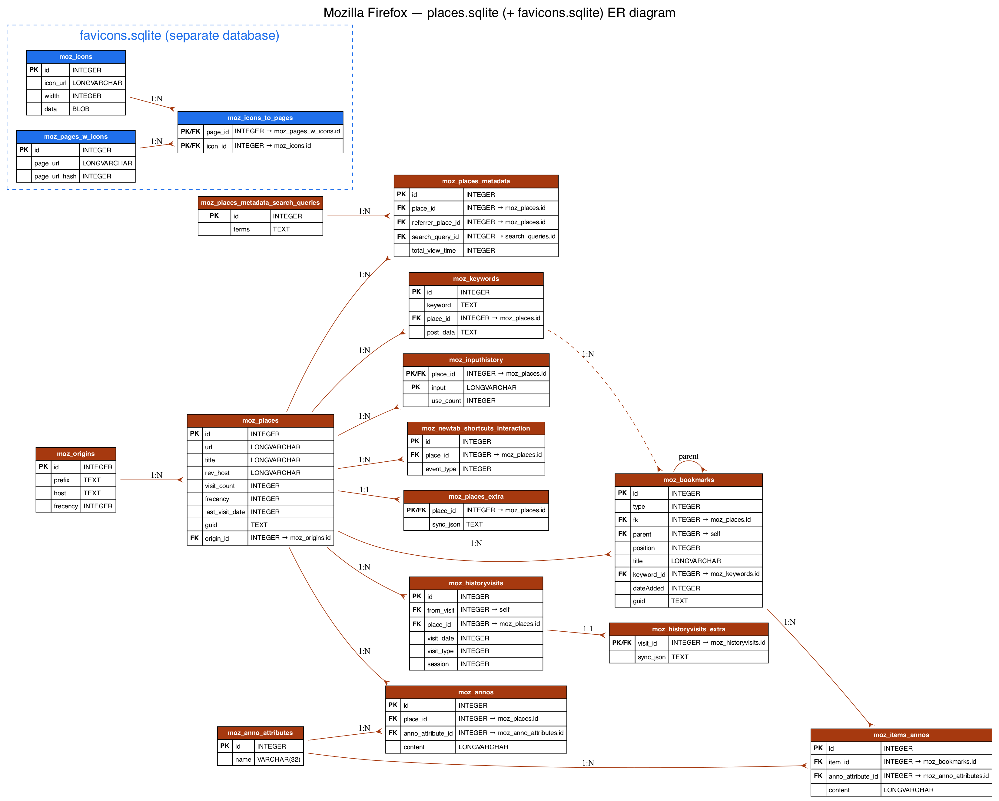

# Mozilla Firefox Internal Browser Data Stores

## Scope

This document describes the principal internal data stores used by Mozilla Firefox for history, bookmarks, and session restoration. The focus is on `places.sqlite` as the primary SQLite repository for browsing history and bookmarks, and on the separate compressed session files used to persist tabs and window state.

## Profile artifacts

Firefox concentrates more browser state in SQLite than Chrome or Safari, but it still separates active session data from the main browsing database.

| Artifact | Typical format | Primary purpose |
|---|---|---|
| `places.sqlite` | SQLite | History, bookmarks, origins, annotations, input history, and related metadata. |
| `favicons.sqlite` | SQLite | Favicons (separate database; tables `moz_icons`, `moz_icons_to_pages`, `moz_pages_w_icons`). |
| `sessionstore.jsonlz4` | JSONLZ4 (compressed) | Saved browser session after closure or crash recovery. |
| `sessionstore-backups/*` | JSONLZ4 (compressed) | Current or recent session state used for crash/session recovery. |

> Verified against the supplied profile: favicons live in `favicons.sqlite`, **not** in `places.sqlite`. There is no `moz_favicons` table in modern Firefox.

## Core places schema

The conceptual model in Firefox is straightforward: `moz_places` describes pages or URLs, `moz_historyvisits` describes visit events, and `moz_bookmarks` describes bookmark nodes that may point back to `moz_places` through the `fk` field.

```mermaid
  erDiagram
    MOZ_PLACES ||--o{ MOZ_HISTORYVISITS : visited_as
    MOZ_PLACES ||--o{ MOZ_BOOKMARKS : bookmarked_as
    MOZ_BOOKMARKS ||--o{ MOZ_BOOKMARKS : parent_of

    MOZ_PLACES {
        INTEGER id PK
        TEXT url
        TEXT title
        TEXT rev_host
        INTEGER visit_count
        INTEGER hidden
        INTEGER typed
        INTEGER frecency
        INTEGER last_visit_date
        TEXT guid
    }
    
    MOZ_HISTORYVISITS {
        INTEGER id PK
        INTEGER from_visit
        INTEGER place_id FK
        INTEGER visit_date
        INTEGER visit_type
        INTEGER session
    }
    
    MOZ_BOOKMARKS {
        INTEGER id PK
        INTEGER fk
        INTEGER parent
        TEXT title
        INTEGER dateAdded
        INTEGER lastModified
        INTEGER type
    }
```

### `moz_places`

`moz_places` is the primary URL catalog for Firefox and typically includes the URL string, title, reverse host (`rev_host`), visit counts, typed flags, frecency, `origin_id` (into `moz_origins`), and last visit timestamps. Favicons are **not** referenced from here — they live in `favicons.sqlite`.

### `moz_historyvisits`

`moz_historyvisits` stores individual visits and links each visit to `moz_places.id` via `place_id`. The `from_visit` field is useful for reconstructing navigation chains.

### `moz_bookmarks`

`moz_bookmarks` stores bookmark nodes (folders and URLs) and links URL bookmarks to `moz_places` through the `fk` column.

## Full Firefox SQLite schema (excerpt)

```sql
CREATE TABLE moz_origins (
    id INTEGER PRIMARY KEY,
    prefix TEXT NOT NULL,
    host TEXT NOT NULL,
    frecency INTEGER NOT NULL,
    recalc_frecency INTEGER NOT NULL DEFAULT 0,
    alt_frecency INTEGER,
    recalc_alt_frecency INTEGER NOT NULL DEFAULT 0,
    block_until_ms INTEGER,
    block_pages_until_ms INTEGER,
    UNIQUE (prefix, host)
);

CREATE TABLE moz_places (
    id INTEGER PRIMARY KEY,
    url LONGVARCHAR,
    title LONGVARCHAR,
    rev_host LONGVARCHAR,
    visit_count INTEGER DEFAULT 0,
    hidden INTEGER DEFAULT 0 NOT NULL,
    typed INTEGER DEFAULT 0 NOT NULL,
    frecency INTEGER DEFAULT -1 NOT NULL,
    last_visit_date INTEGER,
    guid TEXT,
    foreign_count INTEGER DEFAULT 0 NOT NULL,
    url_hash INTEGER DEFAULT 0 NOT NULL,
    description TEXT,
    preview_image_url TEXT,
    site_name TEXT,
    origin_id INTEGER REFERENCES moz_origins(id),
    recalc_frecency INTEGER NOT NULL DEFAULT 0,
    alt_frecency INTEGER,
    recalc_alt_frecency INTEGER NOT NULL DEFAULT 0
);

CREATE TABLE moz_historyvisits (
    id INTEGER PRIMARY KEY,
    from_visit INTEGER,
    place_id INTEGER,
    visit_date INTEGER,
    visit_type INTEGER,
    session INTEGER,
    source INTEGER DEFAULT 0 NOT NULL,
    triggeringPlaceId INTEGER
);

CREATE TABLE moz_bookmarks (
    id INTEGER PRIMARY KEY,
    type INTEGER,
    fk INTEGER DEFAULT NULL,
    parent INTEGER,
    position INTEGER,
    title LONGVARCHAR,
    keyword_id INTEGER,
    folder_type TEXT,
    dateAdded INTEGER,
    lastModified INTEGER,
    guid TEXT,
    syncStatus INTEGER NOT NULL DEFAULT 0,
    syncChangeCounter INTEGER NOT NULL DEFAULT 1
);

CREATE TABLE moz_keywords (
    id INTEGER PRIMARY KEY AUTOINCREMENT,
    keyword TEXT UNIQUE,
    place_id INTEGER,
    post_data TEXT
);

CREATE TABLE moz_annos (
    id INTEGER PRIMARY KEY,
    place_id INTEGER NOT NULL,
    anno_attribute_id INTEGER,
    content LONGVARCHAR,
    flags INTEGER DEFAULT 0,
    expiration INTEGER DEFAULT 0,
    type INTEGER DEFAULT 0,
    dateAdded INTEGER DEFAULT 0,
    lastModified INTEGER DEFAULT 0
);

CREATE TABLE moz_items_annos (
    id INTEGER PRIMARY KEY,
    item_id INTEGER NOT NULL,
    anno_attribute_id INTEGER,
    content LONGVARCHAR,
    flags INTEGER DEFAULT 0,
    expiration INTEGER DEFAULT 0,
    type INTEGER DEFAULT 0,
    dateAdded INTEGER DEFAULT 0,
    lastModified INTEGER DEFAULT 0
);

CREATE TABLE moz_inputhistory (
    place_id INTEGER NOT NULL,
    input LONGVARCHAR NOT NULL,
    use_count INTEGER,
    PRIMARY KEY (place_id, input)
);

-- NOTE: There is NO moz_favicons table. Favicons are stored in a separate
-- favicons.sqlite database (tables moz_icons, moz_icons_to_pages,
-- moz_pages_w_icons). See the favicons section below.

-- Additional auxiliary tables (excerpt) --
CREATE TABLE moz_meta (key TEXT PRIMARY KEY, value NOT NULL) WITHOUT ROWID;
```

## Favicons (separate `favicons.sqlite` database)

```sql
-- These tables live in favicons.sqlite, NOT in places.sqlite.
CREATE TABLE moz_pages_w_icons (
    id INTEGER PRIMARY KEY,
    page_url LONGVARCHAR NOT NULL,
    page_url_hash INTEGER NOT NULL
);
CREATE TABLE moz_icons (
    id INTEGER PRIMARY KEY,
    icon_url LONGVARCHAR NOT NULL,
    fixed_icon_url_hash INTEGER NOT NULL,
    width INTEGER NOT NULL DEFAULT 0,
    root INTEGER NOT NULL DEFAULT 0,
    color INTEGER,
    expire_ms INTEGER NOT NULL DEFAULT 0,
    data BLOB
);
CREATE TABLE moz_icons_to_pages (
    page_id INTEGER NOT NULL,
    icon_id INTEGER NOT NULL,
    expire_ms INTEGER NOT NULL DEFAULT 0,
    PRIMARY KEY (page_id, icon_id),
    FOREIGN KEY (page_id) REFERENCES moz_pages_w_icons ON DELETE CASCADE,
    FOREIGN KEY (icon_id) REFERENCES moz_icons ON DELETE CASCADE
) WITHOUT ROWID;
```

## Complete Firefox `places.sqlite` schema

```sql
CREATE TABLE moz_origins (
    id INTEGER PRIMARY KEY,
    prefix TEXT NOT NULL,
    host TEXT NOT NULL,
    frecency INTEGER NOT NULL,
    recalc_frecency INTEGER NOT NULL DEFAULT 0,
    alt_frecency INTEGER,
    recalc_alt_frecency INTEGER NOT NULL DEFAULT 0,
    block_until_ms INTEGER,
    block_pages_until_ms INTEGER,
    UNIQUE (prefix, host)
);

CREATE TABLE moz_places (
    id INTEGER PRIMARY KEY,
    url LONGVARCHAR,
    title LONGVARCHAR,
    rev_host LONGVARCHAR,
    visit_count INTEGER DEFAULT 0,
    hidden INTEGER DEFAULT 0 NOT NULL,
    typed INTEGER DEFAULT 0 NOT NULL,
    frecency INTEGER DEFAULT -1 NOT NULL,
    last_visit_date INTEGER ,
    guid TEXT,
    foreign_count INTEGER DEFAULT 0 NOT NULL,
    url_hash INTEGER DEFAULT 0 NOT NULL ,
    description TEXT,
    preview_image_url TEXT,
    site_name TEXT,
    origin_id INTEGER REFERENCES moz_origins(id),
    recalc_frecency INTEGER NOT NULL DEFAULT 0,
    alt_frecency INTEGER,
    recalc_alt_frecency INTEGER NOT NULL DEFAULT 0
);

CREATE TABLE moz_places_extra (
  place_id INTEGER PRIMARY KEY NOT NULL,
  sync_json TEXT,
  FOREIGN KEY (place_id) REFERENCES moz_places(id) ON DELETE CASCADE
);

CREATE INDEX moz_places_url_hashindex ON moz_places (url_hash);
CREATE INDEX moz_places_hostindex ON moz_places (rev_host);
CREATE INDEX moz_places_visitcount ON moz_places (visit_count);
CREATE INDEX moz_places_frecencyindex ON moz_places (frecency);
CREATE INDEX moz_places_lastvisitdateindex ON moz_places (last_visit_date);
CREATE UNIQUE INDEX moz_places_guid_uniqueindex ON moz_places (guid);
CREATE INDEX moz_places_originidindex ON moz_places (origin_id);
CREATE INDEX moz_places_altfrecencyindex ON moz_places (alt_frecency);

CREATE TABLE moz_historyvisits (
  id INTEGER PRIMARY KEY,
  from_visit INTEGER,
  place_id INTEGER,
  visit_date INTEGER,
  visit_type INTEGER,
  session INTEGER,
  source INTEGER DEFAULT 0 NOT NULL,
  triggeringPlaceId INTEGER);

CREATE TABLE moz_historyvisits_extra (
  visit_id INTEGER PRIMARY KEY NOT NULL,
  sync_json TEXT,
  FOREIGN KEY (visit_id) REFERENCES moz_historyvisits(id) ON   DELETE CASCADE);

CREATE INDEX moz_historyvisits_placedateindex ON moz_historyvisits (place_id, visit_date);
CREATE INDEX moz_historyvisits_fromindex ON moz_historyvisits (from_visit);
CREATE INDEX moz_historyvisits_dateindex ON moz_historyvisits (visit_date);

CREATE TABLE moz_inputhistory (
  place_id INTEGER NOT NULL,
  input LONGVARCHAR NOT NULL,
  use_count INTEGER,
  PRIMARY KEY (place_id, input));

CREATE TABLE moz_bookmarks (
  id INTEGER PRIMARY KEY,
  type INTEGER,
  fk INTEGER DEFAULT NULL,
  parent INTEGER,
  position INTEGER,
  title LONGVARCHAR,
  keyword_id INTEGER,
  folder_type TEXT,
  dateAdded INTEGER,
  lastModified INTEGER,
  guid TEXT,
  syncStatus INTEGER NOT NULL DEFAULT 0,
  syncChangeCounter INTEGER NOT NULL DEFAULT 1);

CREATE TABLE moz_bookmarks_deleted (
  guid TEXT PRIMARY KEY,
  dateRemoved INTEGER NOT NULL DEFAULT 0);

CREATE INDEX moz_bookmarks_itemindex ON moz_bookmarks (fk, type);
CREATE INDEX moz_bookmarks_parentindex ON moz_bookmarks (parent, position);
CREATE INDEX moz_bookmarks_itemlastmodifiedindex ON moz_bookmarks (fk, lastModified);
CREATE INDEX moz_bookmarks_dateaddedindex ON moz_bookmarks (dateAdded);
CREATE UNIQUE INDEX moz_bookmarks_guid_uniqueindex ON moz_bookmarks (guid);

CREATE TABLE moz_keywords (
  id INTEGER PRIMARY KEY AUTOINCREMENT,
  keyword TEXT UNIQUE,
  place_id INTEGER,
  post_data TEXT);

CREATE TABLE sqlite_sequence(name,seq);

CREATE UNIQUE INDEX moz_keywords_placepostdata_uniqueindex ON moz_keywords (place_id, post_data);

CREATE TABLE moz_anno_attributes (
  id INTEGER PRIMARY KEY,
  name VARCHAR(32) UNIQUE NOT NULL);

CREATE TABLE moz_annos (
  id INTEGER PRIMARY KEY,
  place_id INTEGER NOT NULL,
  anno_attribute_id INTEGER,
  content LONGVARCHAR,
  flags INTEGER DEFAULT 0,
  expiration INTEGER DEFAULT 0,
  type INTEGER DEFAULT 0,
  dateAdded INTEGER DEFAULT 0,
  lastModified INTEGER DEFAULT 0);

CREATE UNIQUE INDEX moz_annos_placeattributeindex ON moz_annos (place_id, anno_attribute_id);

CREATE TABLE moz_items_annos (
  id INTEGER PRIMARY KEY,
  item_id INTEGER NOT NULL,
  anno_attribute_id INTEGER,
  content LONGVARCHAR,
  flags INTEGER DEFAULT 0,
  expiration INTEGER DEFAULT 0,
  type INTEGER DEFAULT 0,
  dateAdded INTEGER DEFAULT 0,
  lastModified INTEGER DEFAULT 0);

CREATE UNIQUE INDEX moz_items_annos_itemattributeindex ON moz_items_annos (item_id, anno_attribute_id);

CREATE TABLE moz_meta (key TEXT PRIMARY KEY, value NOT NULL) WITHOUT ROWID ;

CREATE TABLE moz_places_metadata (id INTEGER PRIMARY KEY, place_id INTEGER NOT NULL, referrer_place_id INTEGER, created_at INTEGER NOT NULL DEFAULT 0, updated_at INTEGER NOT NULL DEFAULT 0, total_view_time INTEGER NOT NULL DEFAULT 0, typing_time INTEGER NOT NULL DEFAULT 0, key_presses INTEGER NOT NULL DEFAULT 0, scrolling_time INTEGER NOT NULL DEFAULT 0, scrolling_distance INTEGER NOT NULL DEFAULT 0, document_type INTEGER NOT NULL DEFAULT 0, search_query_id INTEGER, FOREIGN KEY (place_id) REFERENCES moz_places(id) ON DELETE CASCADE, FOREIGN KEY (referrer_place_id) REFERENCES moz_places(id) ON DELETE CASCADE, FOREIGN KEY(search_query_id) REFERENCES moz_places_metadata_search_queries(id) ON DELETE CASCADE CHECK(place_id != referrer_place_id) );

CREATE UNIQUE INDEX moz_places_metadata_placecreated_uniqueindex ON moz_places_metadata (place_id, created_at);
CREATE INDEX moz_places_metadata_referrerindex ON moz_places_metadata (referrer_place_id);

CREATE TABLE moz_places_metadata_search_queries ( id INTEGER PRIMARY KEY, terms TEXT NOT NULL UNIQUE );

CREATE TABLE moz_previews_tombstones (   hash TEXT PRIMARY KEY ) WITHOUT ROWID;

CREATE TABLE moz_newtab_story_click (   feature TEXT NOT NULL,   timestamp_s INTEGER NOT NULL,   card_format_enum INTEGER NOT NULL,   position INTEGER NOT NULL,   section_position INTEGER NOT NULL,   feature_value REAL NOT NULL DEFAULT 1 );

CREATE TABLE moz_newtab_story_impression (   feature TEXT NOT NULL,   timestamp_s INTEGER NOT NULL,   card_format_enum INTEGER NOT NULL,   position INTEGER NOT NULL,   section_position INTEGER NOT NULL,   feature_value REAL NOT NULL DEFAULT 1 );

CREATE INDEX moz_newtab_story_click_newtab_click_timestampindex ON moz_newtab_story_click (timestamp_s);
CREATE INDEX moz_newtab_story_impression_newtab_impression_timestampindex ON moz_newtab_story_impression (timestamp_s);

CREATE TABLE moz_newtab_shortcuts_interaction (   id INTEGER PRIMARY KEY,   place_id INTEGER NOT NULL REFERENCES moz_places(id) ON DELETE CASCADE,   event_type INTEGER NOT NULL,   timestamp_s INTEGER NOT NULL,   pinned INTEGER NOT NULL CHECK (pinned IN (0, 1)),   tile_position INTEGER NOT NULL);

CREATE INDEX moz_newtab_shortcuts_interaction_timestampindex ON moz_newtab_shortcuts_interaction (timestamp_s);
CREATE INDEX moz_newtab_shortcuts_interaction_placeidindex ON moz_newtab_shortcuts_interaction (place_id);

CREATE TABLE sqlite_stat1(tbl,idx,stat);
```



*ER diagram generated with Graphviz directly from the verified live schema (column names and types match the database exactly).*

### Object inventory of `places.sqlite`

Verified with `.schema` against the live profile: **21 tables, 31 indexes, 0 triggers, 0 views**. `places.sqlite` defines no views or triggers. A full scan of *all 17 SQLite databases* in the Firefox profile found **no views anywhere** and **no triggers** — Firefox keeps this logic in application code, not in the schema.

## ER diagram including auxiliary tables

```mermaid
  erDiagram
    MOZ_ORIGINS ||--o{ MOZ_PLACES : groups
    MOZ_PLACES ||--o{ MOZ_HISTORYVISITS : visited_as
    MOZ_PLACES ||--o{ MOZ_BOOKMARKS : bookmarked_as
    MOZ_PLACES ||--o{ MOZ_ANNOS : has_annotation
    MOZ_PLACES ||--o{ MOZ_INPUTHISTORY : has_input
    MOZ_BOOKMARKS ||--o{ MOZ_BOOKMARKS : parent_of

    MOZ_ORIGINS {
        INTEGER id PK
        TEXT prefix
        TEXT host
    }
    MOZ_PLACES {
        INTEGER id PK
        TEXT url
        TEXT title
        INTEGER visit_count
        INTEGER origin_id FK
    }
    MOZ_HISTORYVISITS {
        INTEGER id PK
        INTEGER place_id FK
        INTEGER visit_date
        INTEGER from_visit
    }
    MOZ_BOOKMARKS {
        INTEGER id PK
        INTEGER fk FK
        INTEGER parent FK
        TEXT title
    }
    MOZ_ANNOS {
        INTEGER id PK
        INTEGER place_id FK
    }
    MOZ_INPUTHISTORY {
        INTEGER place_id PK
        TEXT input
    }
```

> Note: bookmark hierarchy is self‑referential — every node's `parent` points to another row in `moz_bookmarks` (the roots, e.g. `menu________`, `toolbar_____`, are themselves rows). There is no separate `moz_bookmarks_roots` table.

## Non‑SQLite artifacts

* **Session files** – `sessionstore.jsonlz4` and the files under `sessionstore-backups/` are compressed JSONLZ4 archives. They store the state of open windows, tabs, tab histories, and recovery metadata. Use the `lz4` command‑line tool or libraries such as `jsonlz4` to decompress and parse them.
* **Bookmarks JSON** – Firefox also synchronises bookmarks via a JSON payload in its Sync service, but the on‑disk representation lives in `places.sqlite` (see `moz_bookmarks`).

## Example queries for additional tables

```sql
-- Most frequent domains (using moz_places.rev_host)
SELECT rev_host, COUNT(*) AS visits
FROM moz_places
GROUP BY rev_host
ORDER BY visits DESC
LIMIT 20;

-- Retrieve annotations for a given URL
SELECT a.content
FROM moz_annos a
JOIN moz_places p ON p.id = a.place_id
WHERE p.url = 'https://example.com';

-- List recent input history (typed fragments)
SELECT input, use_count
FROM moz_inputhistory
ORDER BY use_count DESC
LIMIT 20;

-- Get favicons (binary blob) for top‑visited sites.
-- NOTE: favicons live in the SEPARATE favicons.sqlite database, so this query
-- must be run against favicons.sqlite (optionally ATTACH places.sqlite to rank
-- by visit_count). Join path: moz_pages_w_icons → moz_icons_to_pages → moz_icons.
SELECT pwi.page_url, i.icon_url, i.width, i.data
FROM moz_pages_w_icons pwi
JOIN moz_icons_to_pages itp ON itp.page_id = pwi.id
JOIN moz_icons i ON i.id = itp.icon_id
LIMIT 10;
```

## Complete inventory of navigation‑related stores in the profile

`places.sqlite` is the hub, but Firefox keeps a lot of navigation state in sibling SQLite databases. Verified file‑by‑file in the profile:

| Store | Format | Navigation data it holds |
|---|---|---|
| `places.sqlite` | SQLite | History, bookmarks, origins, annotations, input history, page metadata (documented above). |
| `favicons.sqlite` | SQLite | Favicons (`moz_icons`, `moz_icons_to_pages`, `moz_pages_w_icons`). |
| `cookies.sqlite` | SQLite | HTTP cookies (`moz_cookies`). |
| `formhistory.sqlite` | SQLite | Saved form‑field autocomplete values (`moz_formhistory`). |
| `permissions.sqlite` | SQLite | Per‑site permissions (`moz_perms`): popups, camera, notifications, etc. |
| `content-prefs.sqlite` | SQLite | Per‑site content preferences (zoom level, etc.). |
| `protections.sqlite` | SQLite | Tracking‑protection event counters (`events`). |
| `storage.sqlite` / `webappsstore.sqlite` | SQLite | Quota/DOM‑Storage (`localStorage`) bookkeeping per origin. |
| `bounce-tracking-protection.sqlite` | SQLite | Bounce‑tracker mitigation state. |
| `sessionstore.jsonlz4` + `sessionstore-backups/` | JSONLZ4 | Open windows/tabs and per‑tab navigation history. |
| `logins.db` + `key4.db` | SQLite | Saved logins (encrypted; key material in `key4.db`). |

### `moz_cookies` (cookies.sqlite)

```sql
CREATE TABLE moz_cookies (
    id INTEGER PRIMARY KEY, originAttributes TEXT NOT NULL DEFAULT '',
    name TEXT, value TEXT, host TEXT, path TEXT,
    expiry INTEGER, lastAccessed INTEGER, creationTime INTEGER,
    isSecure INTEGER, isHttpOnly INTEGER, inBrowserElement INTEGER DEFAULT 0,
    sameSite INTEGER DEFAULT 0, schemeMap INTEGER DEFAULT 0,
    isPartitionedAttributeSet INTEGER DEFAULT 0, updateTime INTEGER,
    CONSTRAINT moz_uniqueid UNIQUE (name, host, path, originAttributes)
);
```

### `moz_formhistory` (formhistory.sqlite)

```sql
CREATE TABLE moz_formhistory (
    id INTEGER PRIMARY KEY, fieldname TEXT NOT NULL, value TEXT NOT NULL,
    timesUsed INTEGER, firstUsed INTEGER, lastUsed INTEGER, guid TEXT
);
-- plus moz_deleted_formhistory, moz_sources, moz_history_to_sources
```

### `moz_perms` (permissions.sqlite) and content prefs

```sql
CREATE TABLE moz_perms (
    id INTEGER PRIMARY KEY, origin TEXT, type TEXT, permission INTEGER,
    expireType INTEGER, expireTime INTEGER, modificationTime INTEGER
);
-- content-prefs.sqlite: groups(id,name) ← prefs(groupID,settingID,value,timestamp) → settings(id,name)
-- protections.sqlite:  events(id, type, count, timestamp)
```

> Firefox timestamps in `places.sqlite`/`cookies.sqlite` are **microseconds** since the Unix epoch (1970‑01‑01); convert with `datetime(visit_date/1000000,'unixepoch')`. This differs from Chrome (microseconds since 1601) and Safari (seconds since 2001).

## Column reference (every documented column)

Firefox timestamps in `places.sqlite`/`cookies.sqlite` are *(microseconds since 1970)* unless noted; convert with `datetime(col/1000000,'unixepoch')`.

### `places.sqlite` › `moz_places`

| Column | Type | Meaning |
|---|---|---|
| `id` | INTEGER PK | Page id; referenced by visits, bookmarks, annotations, metadata. |
| `url` | LONGVARCHAR | Full page URL. |
| `title` | LONGVARCHAR | Last known page title. |
| `rev_host` | LONGVARCHAR | Host reversed char‑by‑char with trailing dot (e.g. `moc.elpmaxe.`) for fast domain grouping. |
| `visit_count` | INTEGER | Number of visible visits. |
| `hidden` | INTEGER | 1 = not shown in autocomplete (typed‑only/framed). |
| `typed` | INTEGER | 1 = the user has typed this URL at least once. |
| `frecency` | INTEGER | Composite "frequency + recency" ranking score (−1 = not yet computed). |
| `last_visit_date` | INTEGER *(µs/1970)* | Most recent visit time. |
| `guid` | TEXT | Sync identifier. |
| `foreign_count` | INTEGER | Count of bookmarks/keywords referencing this place (keeps it from expiring). |
| `url_hash` | INTEGER | Hash of `url` for fast lookups. |
| `description` / `preview_image_url` / `site_name` | TEXT | Open‑Graph‑style page metadata. |
| `origin_id` | INTEGER FK → `moz_origins.id` | The scheme+host this page belongs to. |
| `frecency`/`alt_frecency` + `recalc_*` | — | Current and experimental ranking scores plus "needs recompute" flags. |

### `places.sqlite` › `moz_historyvisits`

| Column | Type | Meaning |
|---|---|---|
| `id` | INTEGER PK | Visit id. |
| `from_visit` | INTEGER FK → self | Referring visit (navigation chain). |
| `place_id` | INTEGER FK → `moz_places.id` | Which page was visited. |
| `visit_date` | INTEGER *(µs/1970)* | When. |
| `visit_type` | INTEGER | 1 LINK, 2 TYPED, 3 BOOKMARK, 4 EMBED, 5 REDIRECT_PERMANENT, 6 REDIRECT_TEMPORARY, 7 DOWNLOAD, 8 FRAMED_LINK, 9 RELOAD. |
| `session` | INTEGER | Browsing‑session id (legacy; often 0). |
| `source` | INTEGER | 0 organic, 1 synced. |
| `triggeringPlaceId` | INTEGER | Page that triggered this navigation (e.g. a search results page). |

### `places.sqlite` › `moz_bookmarks`

| Column | Type | Meaning |
|---|---|---|
| `id` | INTEGER PK | Node id. |
| `type` | INTEGER | 1 = bookmark (URL), 2 = folder, 3 = separator. |
| `fk` | INTEGER FK → `moz_places.id` | The bookmarked page (NULL for folders/separators). |
| `parent` | INTEGER FK → self | Containing folder; the roots (`menu________`, `toolbar_____`, `unfiled_____`, `mobile______`) are themselves rows. |
| `position` | INTEGER | Order within the parent folder. |
| `title` | LONGVARCHAR | Bookmark/folder label. |
| `keyword_id` | INTEGER FK → `moz_keywords.id` | Optional keyword shortcut. |
| `dateAdded` / `lastModified` | INTEGER *(µs/1970)* | Creation / last‑change times. |
| `guid` | TEXT | Sync identifier (roots have fixed guids). |
| `syncStatus` / `syncChangeCounter` | INTEGER | Sync bookkeeping. |

### `places.sqlite` › other tables

| Table.Column | Meaning |
|---|---|
| `moz_origins(id, prefix, host, frecency)` | One row per scheme+host; `prefix` is e.g. `https://`. Aggregates frecency across a site. |
| `moz_keywords(id, keyword, place_id, post_data)` | Keyword shortcuts (e.g. `wiki`) that resolve to a URL/POST body. |
| `moz_anno_attributes(id, name)` | Catalog of annotation names. |
| `moz_annos(id, place_id, anno_attribute_id, content, …)` | Per‑page annotations (key/value). |
| `moz_items_annos(id, item_id, anno_attribute_id, content, …)` | Per‑bookmark annotations; `item_id` → `moz_bookmarks.id`. |
| `moz_inputhistory(place_id, input, use_count)` | Autocomplete: which typed string led to which page, and how often. |
| `moz_places_metadata(id, place_id, referrer_place_id, total_view_time, typing_time, key_presses, scrolling_time, scrolling_distance, document_type, search_query_id)` | Rich per‑page engagement metrics. |
| `moz_places_metadata_search_queries(id, terms)` | Deduplicated search‑query strings referenced by the metadata table. |
| `moz_historyvisits_extra` / `moz_places_extra` | `sync_json` side‑tables (1:1) holding extra sync payloads. |

### `favicons.sqlite`

| Table.Column | Meaning |
|---|---|
| `moz_pages_w_icons(id, page_url, page_url_hash)` | A page that has icons. |
| `moz_icons(id, icon_url, fixed_icon_url_hash, width, root, color, expire_ms, data)` | One icon (one size); `data` is the image BLOB, `width` the pixel size, `root` flags a root‑domain favicon. |
| `moz_icons_to_pages(page_id, icon_id, expire_ms)` | Many‑to‑many link between pages and icons. |

### Sibling navigation databases — column reference

**`cookies.sqlite` › `moz_cookies`** — `name`, `value` (plaintext — Firefox does not encrypt cookie values at rest), `host`, `path`, `expiry` *(seconds/1970)*, `lastAccessed`/`creationTime` *(µs/1970)*, `isSecure`, `isHttpOnly`, `sameSite` (0 none, 1 lax, 2 strict), `schemeMap`, `originAttributes` (partition key for containers/first‑party isolation), `isPartitionedAttributeSet`.

**`formhistory.sqlite` › `moz_formhistory`** — `fieldname` (the form field's name), `value` (stored entry), `timesUsed`, `firstUsed`/`lastUsed` *(µs/1970)*, `guid`. Companion: `moz_deleted_formhistory`, `moz_sources`, `moz_history_to_sources`.

**`permissions.sqlite` › `moz_perms`** — `origin`, `type` (e.g. `popup`, `camera`, `desktop-notification`, `cookie`), `permission` (1 allow, 2 deny, 0 default), `expireType`/`expireTime`, `modificationTime`.

**`content-prefs.sqlite`** — `groups(id, name)` is the site/host; `settings(id, name)` is the preference key (e.g. `browser.content.full-zoom`); `prefs(groupID FK, settingID FK, value, timestamp)` stores the per‑site value.

**`protections.sqlite` › `events`** — `type` (tracker category blocked), `count`, `timestamp` — drives the privacy dashboard.

**`logins.db`** — `loginsL` (local logins; `hostname`, `encryptedUsername`, `encryptedPassword` — encrypted via the key in `key4.db`), `loginsM` (mirror), `breachesL`. Credentials are **not** plaintext.

## Enriched real‑world queries (verified against a live profile)

Everyday analyst queries that decode `visit_type`, resolve referrers, walk the bookmark tree with a recursive CTE, and `ATTACH` `favicons.sqlite`. All executed successfully against the supplied profile (Firefox timestamps are microseconds since 1970).

```sql
-- 1) Full enriched history timeline: decoded visit type, frecency, referrer.
SELECT datetime(hv.visit_date/1000000,'unixepoch','localtime') AS visited,
       p.url, p.title,
       CASE hv.visit_type
            WHEN 1 THEN 'LINK'     WHEN 2 THEN 'TYPED'      WHEN 3 THEN 'BOOKMARK'
            WHEN 4 THEN 'EMBED'    WHEN 5 THEN 'REDIR_PERM' WHEN 6 THEN 'REDIR_TEMP'
            WHEN 7 THEN 'DOWNLOAD' WHEN 8 THEN 'FRAMED'     WHEN 9 THEN 'RELOAD'
            ELSE 'OTHER('||hv.visit_type||')' END AS vtype,
       p.frecency,
       rp.url AS referrer
FROM moz_historyvisits hv
JOIN moz_places p  ON p.id = hv.place_id
LEFT JOIN moz_historyvisits pv ON pv.id = hv.from_visit
LEFT JOIN moz_places       rp ON rp.id = pv.place_id
ORDER BY hv.visit_date DESC;

-- 2) Top domains by visits, using the moz_origins aggregation.
SELECT o.prefix || o.host AS origin,
       count(hv.id)        AS visits,
       max(o.frecency)     AS frecency
FROM moz_origins o
JOIN moz_places  p  ON p.origin_id = o.id
JOIN moz_historyvisits hv ON hv.place_id = p.id
GROUP BY o.id
ORDER BY visits DESC;

-- 3) Every bookmark with its full folder path (recursive walk of moz_bookmarks.parent).
WITH RECURSIVE tree(id, fk, type, title, parent, path) AS (
    SELECT id, fk, type, title, parent, COALESCE(title,'')
      FROM moz_bookmarks WHERE parent = 0 OR parent IS NULL
    UNION ALL
    SELECT b.id, b.fk, b.type, b.title, b.parent, t.path || ' / ' || COALESCE(b.title,'')
      FROM moz_bookmarks b JOIN tree t ON b.parent = t.id
)
SELECT t.path AS location, p.url,
       datetime(b.dateAdded/1000000,'unixepoch') AS added
FROM tree t
JOIN moz_bookmarks b ON b.id = t.id
LEFT JOIN moz_places p ON p.id = t.fk
WHERE t.type = 1                       -- 1 = URL bookmark
ORDER BY t.path;

-- 4) Address-bar learning: which typed string opened which page, weighted.
SELECT ih.input, round(ih.use_count,3) AS weight, p.url
FROM moz_inputhistory ih
JOIN moz_places p ON p.id = ih.place_id
ORDER BY ih.use_count DESC;

-- 5) Search history with engagement (view time) from the metadata tables.
SELECT sq.terms,
       count(*)                       AS searches,
       sum(m.total_view_time)/1000.0  AS total_view_s,
       sum(m.key_presses)             AS key_presses
FROM moz_places_metadata m
JOIN moz_places_metadata_search_queries sq ON sq.id = m.search_query_id
GROUP BY sq.id
ORDER BY searches DESC;

-- 6) Each page with the favicon sizes Firefox stores (separate favicons.sqlite).
ATTACH 'favicons.sqlite' AS fav;
SELECT p.url, p.visit_count,
       group_concat(DISTINCT i.width) AS icon_widths   -- 65535 = scalable (SVG)
FROM moz_places p
JOIN fav.moz_pages_w_icons  pw  ON pw.page_url = p.url
JOIN fav.moz_icons_to_pages itp ON itp.page_id = pw.id
JOIN fav.moz_icons          i   ON i.id        = itp.icon_id
GROUP BY p.id
ORDER BY p.visit_count DESC;
```

## Open tabs, containers, tab groups & synced devices

Firefox keeps live tab state out of `places.sqlite`, in compressed JSON session files. Verified against the profile:

### Open tabs / current session (`sessionstore`)

| File | Role |
|---|---|
| `sessionstore.jsonlz4` (profile root) | The saved session, written on **clean shutdown** (absent here because the session was still active). |
| `sessionstore-backups/recovery.jsonlz4` | The authoritative live session while Firefox is running (crash recovery). |
| `sessionstore-backups/recovery.baklz4` | Backup of the previous `recovery` write. |
| `sessionstore-backups/previous.jsonlz4` | Last clean session before the current one. |
| `sessionstore-backups/upgrade.jsonlz4-<buildid>` | Snapshot taken at each Firefox upgrade. |
| `sessionCheckpoints.json` | Plain JSON tracking how far startup/shutdown progressed. |

**Format:** all `*.jsonlz4`/`*.baklz4` files are **mozLz4** — an 8‑byte magic `mozLz40\0` + 4‑byte little‑endian original size + a raw LZ4 block. Plain `lz4` will **not** read them; use a mozlz4 decoder (Mozilla's `jsonlz4`/`dejsonlz4`, or strip the 12‑byte header and LZ4‑block‑decompress). Verified magic: `6d6f 7a4c 7a34 30` (`mozLz40`).

**JSON structure (keys confirmed in the live file):** `windows[]` → each has `tabs[]` → each tab has `entries[]` (its back/forward navigation list, every entry an `{url, title, …}`), a `selected` index, a `userContextId` (container), plus native **Tab Groups** as a `groups[]` array per window with a `groupId` on each tab.

### Containers — Contextual Identities (`containers.json`)

Plain JSON: `identities[]` with `userContextId`, `name` (or a localization key such as `userContextPersonal.label`), `icon`, and `color`. Tabs reference a container by `userContextId` in the sessionstore. Verified identities include the built‑in `personal`/`work`/`shopping`/`banking` set plus internal ones (`thumbnail`, `webextStorageLocal`).

### Native Tab Groups

Firefox's native tab groups (2025+) live **inside the sessionstore JSON** (`groups`/`groupId`), not in a separate file.

### Tabs from other (synced) devices

Firefox fetches remote tabs **live from the Sync server** and caches them in memory; there is **no dedicated on‑disk database** for synced tabs in the profile. Note: `storage-sync-v2.sqlite` is the WebExtension `storage.sync` area — **not** synced tabs.

### Bookmarks & reading list

Bookmarks are in `places.sqlite` › `moz_bookmarks` (documented above). Firefox has **no native reading list** (it integrates Pocket instead); `tabnotes.sqlite` is a third‑party add‑on store, not a core feature.

### Extraction examples (verified)

```python
# Open tabs — decode a mozLz4 sessionstore file with the standard library only
# (no lz4 package needed) and list every window's tabs. Verified: recovered all
# 6 windows / 44 tabs from the live recovery.jsonlz4.
import struct, json

def lz4_block_decompress(src, out_size):
    out = bytearray(); i = 0; n = len(src)
    while i < n:
        token = src[i]; i += 1
        lit = token >> 4
        if lit == 15:
            while True:
                b = src[i]; i += 1; lit += b
                if b != 255: break
        out += src[i:i+lit]; i += lit
        if i >= n: break
        off = src[i] | (src[i+1] << 8); i += 2
        ml = token & 0x0f
        if ml == 15:
            while True:
                b = src[i]; i += 1; ml += b
                if b != 255: break
        ml += 4
        start = len(out) - off
        for j in range(ml):
            out.append(out[start + j])
    return bytes(out[:out_size])

def read_mozlz4(path):
    raw = open(path, 'rb').read()
    assert raw[:8] == b'mozLz40\x00', 'not a mozLz4 file'
    (out_size,) = struct.unpack('<I', raw[8:12])
    return lz4_block_decompress(raw[12:], out_size)

data = json.loads(read_mozlz4('sessionstore-backups/recovery.jsonlz4'))
for w, win in enumerate(data['windows']):
    groups = {g['id']: g.get('name', '') for g in win.get('groups', [])}
    print(f"window {w}: {len(win['tabs'])} tabs, groups={list(groups.values())}")
    for t in win['tabs']:
        cur = t['entries'][t.get('index', len(t['entries'])) - 1]   # current entry
        print(f"   [grp {t.get('groupId','')}] {cur.get('title','')}  {cur['url']}")
```

```python
# Containers (Contextual Identities) referenced by tabs' userContextId.
import json
for i in json.load(open('containers.json'))['identities']:
    if i.get('public', True):
        print(i['userContextId'], i.get('name') or i.get('l10nID'), i['color'], i['icon'])
```

## Practical interpretation

The most important relationships in `places.sqlite` are `moz_places.id → moz_historyvisits.place_id` for history and `moz_places.id → moz_bookmarks.fk` for bookmark resolution. The auxiliary tables above provide richer context (favicons, annotations, typed input, etc.) that can be combined with the core tables for deeper forensic analysis.
