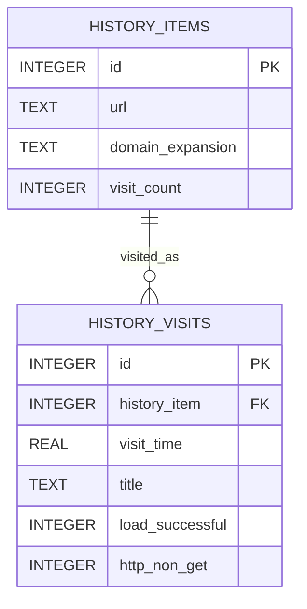
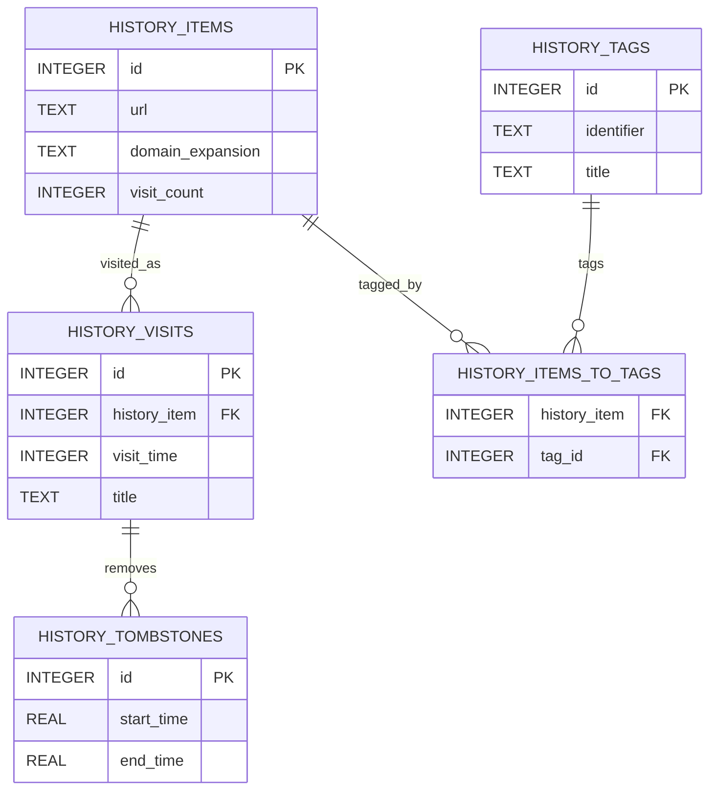
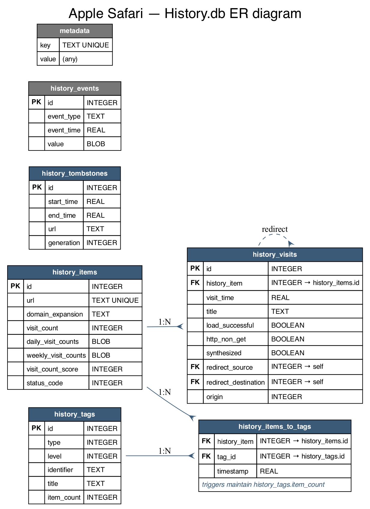

# Apple Safari Internal Browser Data Stores

## Scope

This document describes the principal internal data stores commonly associated with Apple Safari for browsing history, bookmarks, and tab‑related state. The emphasis is on `History.db` as the principal SQLite history artifact, together with the property‑list and auxiliary database artifacts that complement it for bookmarks and synchronized tab state.

## Profile artifacts

Safari does not centralise all browser state in a single SQLite database.

| Artifact | Typical format | Primary purpose |
|---|---|---|
| `History.db` | SQLite | Browsing history, visit records, titles, and visit counters. |
| `Bookmarks.plist` | Property list (binary `.plist`) | Bookmark tree (folders, URLs, Reading List). |
| `Downloads.plist` | Property list (`.plist`) | Download records (Safari stores downloads here, **not** in `History.db`). |
| `RecentlyClosedTabs.plist` | Property list (`.plist`) | Recently closed tab/window state. |
| `CloudTabs.db` | SQLite | iCloud‑synchronised open tabs from other Apple devices (only present when iCloud tab sync is active; absent in this profile). |

> Verified against the supplied profile: `History.db`, `Bookmarks.plist`, `Downloads.plist`, and `RecentlyClosedTabs.plist` are present; `CloudTabs.db` is **not** present in this particular profile.

## Core history schema

The recurring schema pattern reported across Safari history references is a two‑table core: `history_items` contains the canonical page or URL records, and `history_visits` contains visit events linked back to those items.



### `history_items`

`history_items` generally contains URL‑level records and may include fields such as the URL string, expanded domain, and visit counters depending on Safari version and the extraction method used. It functions as the stable identifier table to which individual visits are attached.

### `history_visits`

`history_visits` stores the individual visit events, including timestamps and, in many documented examples, title and HTTP‑related flags. The key analytical relationship is `history_visits.history_item → history_items.id`.

## Full Safari SQLite schema (excerpt)

```sql
CREATE TABLE history_items (
    id INTEGER PRIMARY KEY AUTOINCREMENT,
    url TEXT NOT NULL UNIQUE,
    domain_expansion TEXT NULL,
    visit_count INTEGER NOT NULL,
    daily_visit_counts BLOB NOT NULL,
    weekly_visit_counts BLOB NULL,
    autocomplete_triggers BLOB NULL,
    should_recompute_derived_visit_counts INTEGER NOT NULL,
    visit_count_score INTEGER NOT NULL,
    status_code INTEGER NOT NULL DEFAULT 0
);

CREATE TABLE history_visits (
    id INTEGER PRIMARY KEY AUTOINCREMENT,
    history_item INTEGER NOT NULL REFERENCES history_items(id) ON DELETE CASCADE,
    visit_time REAL NOT NULL,
    title TEXT NULL,
    load_successful BOOLEAN NOT NULL DEFAULT 1,
    http_non_get BOOLEAN NOT NULL DEFAULT 0,
    synthesized BOOLEAN NOT NULL DEFAULT 0,
    redirect_source INTEGER NULL UNIQUE REFERENCES history_visits(id) ON DELETE CASCADE,
    redirect_destination INTEGER NULL UNIQUE REFERENCES history_visits(id) ON DELETE CASCADE,
    origin INTEGER NOT NULL DEFAULT 0,
    generation INTEGER NOT NULL DEFAULT 0,
    attributes INTEGER NOT NULL DEFAULT 0,
    score INTEGER NOT NULL DEFAULT 0
);

CREATE TABLE history_tombstones (
    id INTEGER PRIMARY KEY AUTOINCREMENT,
    start_time REAL NOT NULL,
    end_time REAL NOT NULL,
    url TEXT,
    generation INTEGER NOT NULL DEFAULT 0,
    udid TEXT,
    attributes INTEGER NOT NULL DEFAULT 0
);

CREATE TABLE metadata (key TEXT NOT NULL UNIQUE, value);

CREATE TABLE history_client_versions (client_version INTEGER PRIMARY KEY,last_seen REAL NOT NULL);
CREATE TABLE history_event_listeners (listener_name TEXT PRIMARY KEY NOT NULL UNIQUE,last_seen REAL NOT NULL);
CREATE TABLE history_events (id INTEGER PRIMARY KEY AUTOINCREMENT,event_type TEXT NOT NULL,event_time REAL NOT NULL,pending_listeners TEXT NOT NULL,value BLOB);
CREATE TABLE history_tags (id INTEGER PRIMARY KEY,type INTEGER NOT NULL,level INTEGER NOT NULL,identifier TEXT NOT NULL,title TEXT NOT NULL,modification_timestamp REAL NOT NULL,item_count INTEGER NOT NULL DEFAULT 0);
CREATE TABLE history_items_to_tags (history_item INTEGER NOT NULL,tag_id INTEGER NOT NULL,timestamp REAL NOT NULL,FOREIGN KEY(tag_id) REFERENCES history_tags(id) ON DELETE CASCADE,FOREIGN KEY(history_item) REFERENCES history_items(id) ON DELETE CASCADE,UNIQUE(history_item, tag_id) ON CONFLICT REPLACE);

-- Triggers that keep history_tags.item_count in sync with the join table:
CREATE TRIGGER increment_count_on_insert AFTER INSERT ON history_items_to_tags
BEGIN
    UPDATE history_tags SET item_count = item_count + 1 WHERE id = NEW.tag_id;
END;
CREATE TRIGGER decrement_count_on_delete BEFORE DELETE ON history_items_to_tags
BEGIN
    UPDATE history_tags SET item_count = item_count - 1 WHERE id = OLD.tag_id;
END;
```

> `History.db` contains exactly these objects (verified with `.schema`): tables `history_items`, `history_visits`, `history_tombstones`, `history_tags`, `history_items_to_tags`, `history_events`, `history_event_listeners`, `history_client_versions`, `metadata`; plus the two triggers above. There are **no** views.

## ER diagram including auxiliary tables





*ER diagram generated with Graphviz directly from the verified live schema (column names and types match the database exactly).*

### Object inventory of `History.db`

Verified with `.schema` against the live profile: **10 tables, 11 indexes, 2 triggers, 0 views** (the two triggers are the `item_count` maintainers shown above). A full scan of *all 7 SQLite databases* in the Safari profile found **no views anywhere**; the only triggers in the whole profile are these two.

## Non‑SQLite artifacts

* **Bookmarks** – stored in `Bookmarks.plist` (a binary plist). Each node contains keys such as `WebBookmarkType`, `URLString`, `URIDictionary` (with the title), `Children`, etc. Use `plutil -convert xml1` or any plist parser to read it.
* **Downloads** – stored in `Downloads.plist` (present in this profile), **not** in `History.db`. Each entry includes the source URL, destination path, and byte counters.
* **Recently closed tabs** – stored in `RecentlyClosedTabs.plist`.
* **CloudTabs.db** – an ancillary SQLite database that synchronises open tabs across devices via iCloud. It is only present when iCloud tab sync is active (it is **absent** in this profile).
* **History tombstones** – the `history_tombstones` table inside `History.db` records deletions (for sync reconciliation), not live session state.

## Example queries for additional tables

```sql
-- Recent browsing history (first 10 rows)
SELECT datetime(visit_time + 978307200, 'unixepoch', 'localtime') AS visit_time_local,
       i.url,
       v.title,
       v.load_successful,
       v.http_non_get
FROM history_visits v
JOIN history_items i ON i.id = v.history_item
ORDER BY v.visit_time DESC
LIMIT 10;

-- Visits that were redirects (source → destination)
SELECT src.id AS src_visit,
       dst.id AS dst_visit,
       i.url,
       datetime(src.visit_time + 978307200, 'unixepoch', 'localtime') AS src_time,
       datetime(dst.visit_time + 978307200, 'unixepoch', 'localtime') AS dst_time
FROM history_visits src
JOIN history_visits dst ON src.redirect_destination = dst.id
JOIN history_items i ON i.id = src.history_item
ORDER BY src.visit_time DESC
LIMIT 10;

-- List all tags used for history items (useful for Safari Reading List, etc.)
SELECT t.identifier, t.title, COUNT(*) AS item_count
FROM history_tags t
JOIN history_items_to_tags it ON it.tag_id = t.id
GROUP BY t.id
ORDER BY item_count DESC;
```

## Complete inventory of navigation‑related stores in the profile

Safari spreads navigation data across SQLite databases **and** property lists. The full set found in the profile (`~/Library/Safari/`), verified file‑by‑file:

| Store | Format | Navigation data it holds |
|---|---|---|
| `History.db` | SQLite | History items, visits, redirects, tags, tombstones (documented above). |
| `Bookmarks.plist` | binary plist | Bookmark tree, folders, Reading List. |
| `Downloads.plist` | plist | Download records (URL, destination, byte counters). |
| `RecentlyClosedTabs.plist` | plist | Recently closed tabs/windows for the "Reopen" menu. |
| `TopSites.plist` | plist | Pinned/most‑visited start‑page tiles. |
| `PerSitePreferences.db` | SQLite | Per‑site settings (zoom, autoplay, camera/mic, content‑blocker overrides). |
| `PerSiteZoomPreferences.plist` | plist | Per‑site page‑zoom levels. |
| `CloudTabs.db` | SQLite | iCloud open tabs from other devices (absent in this profile). |
| `ContentBlockerStatistics.db` | SQLite | Counters of trackers/resources blocked. |
| `BlockedBannerHighlights.db` | SQLite | Dismissed cookie/consent‑banner state. |
| `IgnoredSiriSuggestedSites.db` | SQLite | Sites excluded from Siri suggestions. |
| `UserDefinedContentBlockers.db` | SQLite | User content‑blocker rules. |
| `CloudAutoFillCorrections.db` | SQLite | AutoFill correction learning (form/data, not history). |
| `SearchDescriptions.plist` / `UserNotificationPermissions.plist` / `UserMediaPermissions.plist` | plist | Search‑engine descriptions and per‑site permission grants. |

### `PerSitePreferences.db` schema

```sql
CREATE TABLE default_preferences (...);   -- catalog of preference keys + default values
CREATE TABLE preference_values (...);      -- per‑origin overrides (zoom, autoplay, etc.)
```

> Passwords are **not** stored in any of these files — Safari keeps credentials in the macOS Keychain, outside the Safari profile directory.

## Column reference (every documented column)

Safari timestamps are *(Cocoa epoch)* — seconds since 2001‑01‑01 UTC; convert with `datetime(col + 978307200,'unixepoch')`.

### `History.db` › `history_items`

| Column | Type | Meaning |
|---|---|---|
| `id` | INTEGER PK | Item id; referenced by `history_visits.history_item`. |
| `url` | TEXT UNIQUE | The page URL (one row per distinct URL). |
| `domain_expansion` | TEXT | "Important" host fragment used for autocomplete (e.g. `apple` for `apple.com`). |
| `visit_count` | INTEGER | Total visits to this URL. |
| `daily_visit_counts` | BLOB | Packed per‑day visit histogram (recent days). |
| `weekly_visit_counts` | BLOB | Packed per‑week histogram (older buckets). |
| `autocomplete_triggers` | BLOB | Strings that should surface this URL in the address bar. |
| `should_recompute_derived_visit_counts` | INTEGER | Flag: histograms need rebuilding. |
| `visit_count_score` | INTEGER | Ranking score derived from visits. |
| `status_code` | INTEGER | Last HTTP status seen for the URL. |

### `History.db` › `history_visits`

| Column | Type | Meaning |
|---|---|---|
| `id` | INTEGER PK | Visit id. |
| `history_item` | INTEGER FK → `history_items.id` | Which URL was visited. |
| `visit_time` | REAL *(Cocoa epoch)* | When the visit occurred. |
| `title` | TEXT | Page title at visit time. |
| `load_successful` | BOOLEAN | Whether the load completed. |
| `http_non_get` | BOOLEAN | 1 = the request was not a plain GET (POST etc.). |
| `synthesized` | BOOLEAN | 1 = visit was generated by Safari, not a real navigation. |
| `redirect_source` | INTEGER FK → self (UNIQUE) | The visit that redirected **to** this one. |
| `redirect_destination` | INTEGER FK → self (UNIQUE) | The visit this one redirected **to**. |
| `origin` | INTEGER | Visit origin (e.g. local vs. synced). |
| `generation` | INTEGER | Sync generation counter. |
| `attributes` | INTEGER | Bitmask of per‑visit flags. |
| `score` | INTEGER | Visit relevance score. |

### `History.db` › other tables

| Table.Column | Meaning |
|---|---|
| `history_tombstones(id, start_time, end_time, url, generation, udid, attributes)` | Records deletions over a time range so sync can propagate removals. |
| `history_tags(id, type, level, identifier, title, item_count)` | Tag definitions; `item_count` is kept current by the two triggers. |
| `history_items_to_tags(history_item, tag_id, timestamp)` | M:N link between items and tags (UNIQUE on the pair). |
| `history_events(id, event_type, event_time, pending_listeners, value)` | Change‑event queue for in‑process listeners. |
| `history_event_listeners(listener_name, last_seen)` | Registered consumers of those events. |
| `history_client_versions(client_version, last_seen)` | Tracks which Safari schema versions have opened the DB. |
| `metadata(key, value)` | DB‑level key/value settings. |

### `PerSitePreferences.db` (per‑site settings)

| Table.Column | Meaning |
|---|---|
| `default_preferences(id, preference, default_value, sync_data)` | Catalog of preference keys and their default values. |
| `preference_values(id, domain, preference, preference_value, timestamp, record_name)` | Per‑domain overrides (zoom, autoplay, camera/mic, content blockers); UNIQUE on `(domain, preference)`. |

> Bookmarks (`Bookmarks.plist`), downloads (`Downloads.plist`), recently closed tabs, and top sites are **plists**, not SQL tables — parse with `plutil`/a plist library; they have no column schema.

## Enriched real‑world queries (verified against a live profile)

Everyday analyst queries for Safari: decode the Cocoa epoch, resolve redirect source/destination by self‑joining `history_visits`, and surface the tag relationships. All executed successfully against the supplied profile (Safari timestamps are seconds since 2001‑01‑01).

```sql
-- 1) Full enriched timeline: local time, load result, and resolved redirect link.
SELECT datetime(v.visit_time + 978307200,'unixepoch','localtime') AS visited,
       i.url,
       v.title,
       CASE v.load_successful WHEN 1 THEN 'ok' ELSE 'fail' END AS load,
       v.http_non_get,
       CASE WHEN v.redirect_destination IS NOT NULL THEN 'redirects to visit '||v.redirect_destination
            WHEN v.redirect_source      IS NOT NULL THEN 'redirected from visit '||v.redirect_source
            ELSE '' END AS redirect
FROM history_visits v
JOIN history_items  i ON i.id = v.history_item
ORDER BY v.visit_time DESC;

-- 2) Full redirect resolution: source URL -> destination URL (both ends joined to items).
SELECT datetime(sv.visit_time + 978307200,'unixepoch') AS when_,
       si.url AS source_url,
       di.url AS destination_url
FROM history_visits sv
JOIN history_visits dv ON sv.redirect_destination = dv.id
JOIN history_items  si ON si.id = sv.history_item
JOIN history_items  di ON di.id = dv.history_item
ORDER BY sv.visit_time DESC;

-- 3) Most-visited pages with their first/last visit window and visit span.
SELECT i.url, i.visit_count,
       datetime(min(v.visit_time)+978307200,'unixepoch') AS first_visit,
       datetime(max(v.visit_time)+978307200,'unixepoch') AS last_visit,
       count(v.id) AS recorded_visits
FROM history_items  i
JOIN history_visits v ON v.history_item = i.id
GROUP BY i.id
ORDER BY i.visit_count DESC
LIMIT 50;

-- 4) Daily activity histogram (local days).
SELECT date(v.visit_time + 978307200,'unixepoch','localtime') AS day,
       count(*) AS visits
FROM history_visits v
GROUP BY day ORDER BY day DESC;

-- 5) Items grouped by tag (uses the trigger-maintained item_count for a cross-check).
SELECT t.identifier, t.title, t.item_count,
       count(it.history_item) AS items_via_join
FROM history_tags t
LEFT JOIN history_items_to_tags it ON it.tag_id = t.id
GROUP BY t.id
ORDER BY t.item_count DESC;
```

> The per‑day/per‑week visit histograms in `history_items.daily_visit_counts` / `weekly_visit_counts` are packed binary BLOBs; they are not directly queryable in SQL and require decoding the Safari packed‑counter format in application code.

## Open tabs, tab groups, reading list & iCloud devices

Safari concentrates bookmarks, tab groups, and the reading list in **one** binary plist, and keeps cross‑device tabs in a separate SQLite DB. Verified against the profile:

### Bookmarks + Tab Groups + Reading List — `Bookmarks.plist`

All three live in `Bookmarks.plist` (binary plist; convert with `plutil -convert xml1`). Each node carries a `WebBookmarkType` (counts verified in this profile):

| `WebBookmarkType` | Meaning |
|---|---|
| `WebBookmarkTypeLeaf` (1881) | A single bookmark **or** a reading‑list item. Has `URLString`, `URIDictionary.title`; reading‑list items additionally carry a `ReadingList` / `ReadingListNonSync` dict (`DateAdded`, `DateLastViewed`, `PreviewText`). |
| `WebBookmarkTypeList` (12) | A folder — also how **named Tab Groups** and the **Reading List** container itself are represented (`Title` e.g. `com.apple.ReadingList`, `BookmarksBar`, `BookmarksMenu`). |
| `WebBookmarkTypeProxy` (1) | A special proxy node (e.g. the History proxy). |

So a Tab Group is a `WebBookmarkTypeList` whose children are the group's tabs; the Reading List is the list node titled `com.apple.ReadingList`.

### Reading‑list offline copies — `ReadingListArchives/`

`ReadingListArchives/<UUID>/` holds the saved offline webarchive of each reading‑list page (78 archived items in this profile). The UUID links back to the reading‑list leaf in `Bookmarks.plist`.

### Open tabs on this device & recently closed

Recently closed tabs/windows are in `RecentlyClosedTabs.plist` (for the "Reopen" menu). The live current‑session tab set is stored in per‑window session plists (the last‑session plist is not present in this snapshot).

### Tabs from other devices — iCloud Tabs (`CloudTabs.db`)

Open tabs from your **other Apple devices** sync via iCloud into `CloudTabs.db` (SQLite), which maps each device to its currently open tab URLs and feeds the "iCloud Tabs" sidebar / shared Tab Groups. It is present only when iCloud tab sync is active — **absent in this profile**. `CloudBookmarksMigrationCoordinator/` and `CloudHistoryRemoteConfiguration.plist` are related iCloud‑sync scaffolding.

### Bookmarks backup

`AutomaticBookmarksBackup.html` is a periodic human‑readable HTML export of the bookmark tree (Netscape bookmark format).

### Extraction examples (verified)

```python
# Bookmarks.plist — one walk yields bookmarks, Reading List, and Tab Groups,
# using only the standard library (plistlib reads binary plists directly).
import plistlib
d = plistlib.load(open('Bookmarks.plist', 'rb'))

def walk(node, depth=0):
    t = node.get('WebBookmarkType')
    if t == 'WebBookmarkTypeList':                 # a folder / Tab Group / Reading List
        kids = node.get('Children', [])
        leaves = sum(1 for c in kids if c.get('WebBookmarkType') == 'WebBookmarkTypeLeaf')
        print(f"{'  '*depth}{node.get('Title','(untitled)')}  [{leaves} items]")
    elif t == 'WebBookmarkTypeLeaf':               # a bookmark OR a reading-list item
        title = node.get('URIDictionary', {}).get('title', '')
        url   = node.get('URLString', '')
        if 'ReadingList' in node:                   # reading-list-only metadata
            rl = node['ReadingList']
            print(f"{'  '*depth}[RL] {title}  added={rl.get('DateAdded')}  {url}")
        else:
            print(f"{'  '*depth}- {title}  {url}")
    for c in node.get('Children', []):
        walk(c, depth + 1)

walk(d)
# Verified on the live profile: folders BookmarksBar, com.apple.ReadingList (455
# items), and Tab-Group folders "tabs1"/"tabs2"/"Saved Tabs" were all recovered.
```

```python
# Recently closed tabs (and Downloads.plist) are ordinary plists too:
import plistlib
rc = plistlib.load(open('RecentlyClosedTabs.plist', 'rb'))
dl = plistlib.load(open('Downloads.plist', 'rb'))
```

```sql
-- Tabs from other Apple devices: when iCloud tab sync is active, query CloudTabs.db
-- (absent in this profile). Typical shape — devices and their open-tab URLs:
SELECT d.device_name, t.url, t.title
FROM cloud_tabs t JOIN cloud_tab_devices d ON d.device_uuid = t.device_uuid;
```

## Practical interpretation

The essential relationship in Safari history analysis is `history_items.id → history_visits.history_item`. Analysts who need only the visit timeline can often work entirely from `History.db`, but those who need bookmarks, recently closed tabs, or iCloud‑synchronised open tabs must also parse the plist files and, where present, `CloudTabs.db`. Safari therefore follows the same broad architectural principle as Chrome: persistent browser state is distributed across multiple artifact types rather than being centralised in a single relational database.
